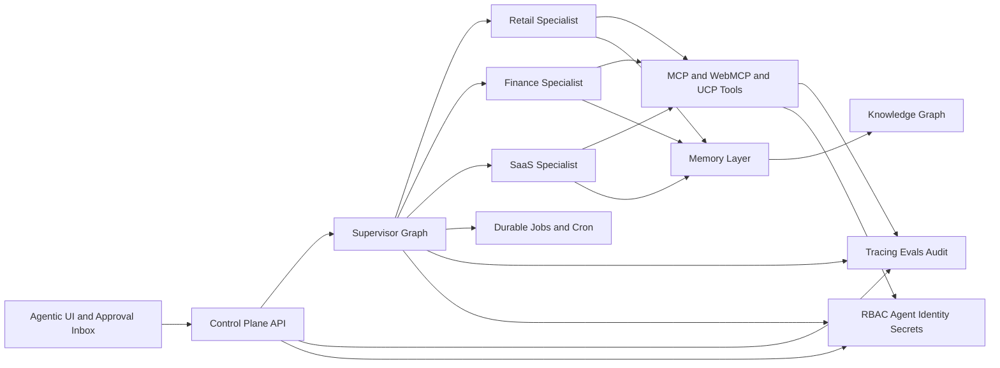
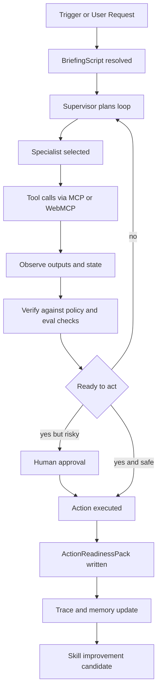

# Dark Factory OS

## Executive summary

The best flagship repository for your next career jump is **not** another assistant, wrapper, or single-use industry demo. It should be a **governed, agentic enterprise operations platform** that makes a strong claim and then proves it: one core control plane, one reusable orchestration runtime, one typed skill system, one memory layer, one observability spine, and several vertical packs that show the same architecture can run retail or CPG operations, finance operations, and SaaS operations with different skills, tools, policies, and user interfaces. That is the most recruiter-legible way to show you understand where the market has actually moved between 2024 and 2026. Across official guidance and platform releases, the field has converged on a similar reality: durable state, typed tools, controlled autonomy, human approvals, observability, and identity-governed access matter more than flashy multi-agent demos. OpenAI’s guide explicitly recommends starting with strong tools and a single agent before adding multi-agent complexity; LangGraph positions itself around long-running stateful orchestration; Google ADK emphasizes build-run-evaluate-scale; and Microsoft Foundry centers managed deployment, identity, observability, and built-in tools. citeturn32view0turn33view2turn33view0turn33view1turn33view3

For your positioning, I recommend a repository called **`dark-factory-os`** with the subtitle **“Governed agentic operations platform for enterprise workflows.”** The phrase “Dark Factory” is memorable, but the deliverable should clearly mean **lights-out knowledge work with guardrails**, not unchecked autonomy. The project should show a supervisor agent coordinating specialists, loop engineering with plan-act-observe-verify-retry, remote MCP and WebMCP integrations, a Git-backed Skill Registry, a Postgres-first memory and knowledge layer, durable jobs, evals, audit trails, RBAC, agent identity, and cost/performance dashboards. It should also expose modern UX patterns: chat, generative UI widgets, approval inboxes, trace timelines, and per-user personalized workbenches. This maps directly to what real products are advertising: Shopify Sidekick uses business context and permission-aware action in admin; Ramp’s finance agents emphasize policy-aware approvals, anomaly detection, and spend governance; and enterprise platforms from OpenAI, Google, and Microsoft are all moving toward stateful, tool-rich, evaluated agents rather than generic chatbots. citeturn7view1turn25view0turn25view1turn33view3turn33view0turn33view1

The central recommendation is therefore:

**Build a repository that looks like a mini product company, not a demo notebook.**  
The repo should prove six things simultaneously:  
first, you understand the current agent stack;  
second, you can architect governed autonomy;  
third, you can implement memory, tools, and protocols correctly;  
fourth, you can evaluate and improve a system systematically;  
fifth, you understand enterprise controls;  
and sixth, you can turn one platform into multiple vertical solutions without rewriting the core. Those are precisely the signals that separate “AI tinkerer” from “AI-native future C-level builder.” citeturn32view0turn33view2turn9search5turn18search8turn16search2

The assumptions used in this report are straightforward. Hosting is cloud-neutral. Models are pluggable. The repo is a public monorepo. Local development uses Docker Compose. Production examples can target any modern cloud. High-risk actions always require approval. Where the literature is still immature or fragmented, I say so explicitly. Terms like **“compound engineering”** and **“ActionReadinessPack”** are treated here as design patterns or proposed artifacts rather than universally standardized terms. The artifact design is adapted from Structured Agentic Software Engineering work on BriefingScript, LoopScript, CRP, and MRP. citeturn19search1turn19search0

## Why this is the right project now

The real shift from 2024 to 2026 is that “agentic AI” stopped meaning simply “LLM with tools” and started meaning **stateful, evaluated, durable, identity-governed operational software**. In 2024, the most important building blocks were MCP, GraphRAG, Contextual Retrieval, and realistic enterprise workflow benchmarks such as WorkArena. In 2025, the ecosystem added stronger agent frameworks, open skill packaging, more disciplined agent engineering discourse, and the first serious software-engineering artifact models for human-agent collaboration. By 2026, the frontier moved again toward sandboxed long-horizon execution, browser-native protocols like WebMCP, commerce protocols like UCP, and enterprise control features such as dedicated agent identity, traceability, and managed deployment. citeturn20search15turn12search1turn12search13turn27search0turn31search9turn26search0turn23view0turn19search1turn17view0turn17view1turn28search9turn33view1turn21search10

That matters for your project choice because **recruiters and hiring managers are now overexposed to thin “AI copilot” demos**. A repo that really stands out must show that you know where autonomy breaks in production and how to design around those breakpoints. The official documentation is unusually aligned on this. OpenAI says start small, maximize a single agent’s capabilities first, and only split the system when complexity, tool confusion, or branching logic actually demand it. LangGraph frames the heart of production agents as durable execution, persistence, memory, and human-in-the-loop. Microsoft Foundry and Okta both elevate identity, observability, and controlled deployment to first-class concerns. CSA survey data shows enterprises are adopting agents faster than they are governing them. citeturn32view0turn33view2turn33view1turn18search8turn9search5turn9search1

That leads to a very specific thesis for your repo:

**Your flagship should be a platform repo pretending to be a startup-grade internal product suite.**  
It should feel like the internal AI operating system for a mid-market or enterprise company, not a chatbot. The same core should power three demo operating modes:

| Vertical pack | Hero workflow | What it proves |
|---|---|---|
| Retail and CPG | Promotion and replenishment control room | Agentic UI, supply and pricing context, UCP/WebMCP applicability |
| Finance | AP and spend-policy control plane | Governance, approvals, audit, unit economics, policy compliance |
| SaaS | Incident and revenue operations autopilot | Long-running tasks, copilots for ops teams, memory, evals |

Those choices are not arbitrary. Shopify’s Sidekick shows the value of domain-native action plus business context and role-aware permissions inside the commerce admin. Ramp shows that finance agents become credible when they are policy-aware, approval-aware, and cost-governed across both operational token spend and actual transactional spend. Those are strong product analogues for an internal agentic control plane. citeturn7view1turn25view0turn25view1turn25view2

The state of the art also suggests an important **portfolio strategy**: do not build a maximalist autonomous swarm from day one. Build **workflow-local specialists** first, then put them behind a common supervisor and shared control plane. That respects OpenAI’s single-agent-first recommendation while still giving recruiters a visible multi-agent architecture at the platform layer. In other words, the repo should show **one agent per workflow, many workflows per platform, and one supervisor for cross-workflow composition**. citeturn32view0turn33view3turn33view2

## Recommended architecture

The strongest architecture for this repo is a **hybrid control-plane design**:

- **LangGraph** as the primary orchestration runtime for stateful graphs, persistence, interrupts, and long-running workflow control.
- **OpenAI Agents SDK** as the specialist work harness whenever a step needs sandboxed file work, commands, approvals, or model-native agent loops.
- **Temporal or Inngest** for durable scheduling, retries, cron, and event-driven long-running jobs.
- **MCP** for server-side tools and external systems.
- **WebMCP** for human-in-the-loop browser cooperation on pages where agent actuation should remain visible and brand-safe.
- **UCP** as an optional commerce-specific adapter for retail flows where agentic checkout or direct-buy semantics matter.
- **Agent Skills-compatible folders** as the portable skill packaging layer.
- **Postgres plus pgvector** as the default operational database and vector layer, with **Neo4j GraphRAG** as an optional knowledge graph sidecar when cross-document relationships matter.
- **OpenInference plus OpenTelemetry** as the trace schema spine, with LangSmith or Phoenix for visualization and evaluation. citeturn33view2turn33view3turn21search10turn13search19turn20search1turn20search2turn17view0turn17view1turn23view0turn11search0turn12search0turn10search12turn10search9turn10search3turn9search7

The reason this combination is strong is that it demonstrates judgment. LangGraph gives you explicit control over stateful orchestration. OpenAI’s SDK gives you a modern code-first agent harness, MCP support, resumable state surfaces, orchestration/handoffs, human review, and sandbox execution. Temporal or Inngest fills the classic weakness of many agent demos: they work during a single request and then collapse when a task must wait, recover, retry, or resume later. citeturn33view2turn33view3turn21search10turn13search0turn13search1



The protocol strategy is equally important. **MCP** is the dominant server-side tool interface, with official transports based on stdio and Streamable HTTP, standardized tools, and an authorization spec for HTTP transports. OpenAI supports remote MCP servers, and Microsoft Foundry exposes MCP servers among platform tools. **WebMCP** complements that by letting websites expose browser-side tools directly to agents in the page, preserving user visibility and page context instead of forcing brittle UI automation or backend-only integration. **UCP** is a separate but important signal for commerce-oriented agents because it standardizes more of the end-to-end shopping flow and is explicitly designed to interoperate with MCP and A2A. Your repo should show that you understand where each belongs. citeturn20search6turn20search1turn16search21turn20search2turn33view1turn17view0turn17view3turn17view1turn17view2

### Orchestrator comparison

The table below synthesizes the most relevant orchestrators and runtimes for a recruiter-grade enterprise repo. citeturn33view2turn33view3turn33view0turn33view1turn16search3turn13search1

| Option | Best use | Strengths | Weaknesses | Recommendation |
|---|---|---|---|---|
| **LangGraph** | Core orchestration runtime | Long-running stateful graphs, persistence, memory, human-in-the-loop, strong production framing. citeturn33view2 | Low-level, more architecture work on you. citeturn33view2 | **Use as core supervisor runtime** |
| **OpenAI Agents SDK** | Specialist agent harness | Code-first agents, orchestration/handoffs, MCP, results/state surfaces, sandbox execution. citeturn33view3turn21search10 | Best when you control orchestration yourself; not a full enterprise control plane by itself. citeturn33view3 | **Use for sandboxed specialists** |
| **Google ADK** | Alternate multi-agent implementation | Open source, multi-language, workflow agents plus dynamic routing, built-in eval framing. citeturn33view0 | Less universal mindshare in OSS portfolio land than LangGraph. | Show as adapter or secondary benchmark |
| **Microsoft Foundry Agent Service** | Managed hosting and enterprise deployment | Managed runtime, built-in tools, observability, RBAC, Entra identity, publishing. citeturn33view1 | Proprietary managed platform; not ideal as the only showcase for OSS skill. | Mention compatibility, do not make it the only runtime |
| **AutoGen** | Historical reference | Multi-agent pioneer. citeturn16search7 | Official repo states maintenance mode. citeturn16search3 | Do not build core repo on it |
| **Inngest AgentKit** | Event-driven jobs and networks | Networks of agents, orchestration-first framing, cloud fault tolerance. citeturn13search1turn13search14 | Less mature as a general control-plane story than LangGraph plus Temporal. | Good optional job engine |
| **Temporal** | Durable execution control | Crash recovery, retries, timeouts, long waits, LangGraph integration. citeturn13search0turn13search19 | Not an agent framework, more of a reliability substrate. | **Use for cron and long-lived flows** |

### Protocol comparison

| Protocol | Scope | Where it belongs in your repo | Evidence |
|---|---|---|---|
| **MCP** | Server-side tools, resources, prompts, auth, transport | Standard bridge to SaaS systems, data sources, and internal tools | citeturn20search1turn20search6turn16search21 |
| **WebMCP** | Browser-page tools with visible user context | Human-visible browser cooperation, form filling, interactive admin pages | citeturn17view0turn17view3 |
| **UCP** | Commerce-specific end-to-end transactions | Retail or CPG direct-buy and checkout templates | citeturn17view1turn17view2 |

### Agent flow



## Data, memory, skills, and artifacts

The recommended **default data architecture** is intentionally conservative: **Postgres for system-of-record tables, pgvector for semantic retrieval, object storage for raw artifacts, and optional Neo4j for graph-heavy use cases.** That is the best tradeoff between portfolio clarity and enterprise realism. pgvector keeps transactional and vector data close to the workflow system. Neo4j becomes useful when you want explainable cross-entity retrieval, relationship traversal, and visual graph demos for account, vendor, policy, or incident networks. Microsoft GraphRAG and Neo4j’s official GraphRAG package both support this direction. citeturn11search0turn11search12turn12search9turn12search0turn12search13

Your memory model should be **layered**, not monolithic:

- **short-term working memory** for the current run or thread,
- **episodic memory** for prior run outcomes,
- **semantic memory** for stable facts and policies,
- **procedural memory** in skills and scripts,
- **graph memory** for durable relationships across people, systems, vendors, products, contracts, and workflows. citeturn21search8turn21search4turn21search3turn11search23

This layered approach is supported by both theory and tooling. MemGPT formalized hierarchical memory ideas for limited-context agents. LangGraph distinguishes short-term thread state from long-term memory across namespaces. Zep now explicitly frames agent memory as temporal knowledge graphs and governed context retrieval. Hermes persists session history and memory summaries while also compressing context and writing durable files. citeturn21search3turn21search4turn11search11turn23view3

### Memory and knowledge options

| Store | Best fit | Why it matters | Evidence |
|---|---|---|---|
| **LangGraph Store** | App-native long-term memory | Cross-thread JSON memory attached to graph runtime | citeturn21search4turn33view2 |
| **Postgres plus pgvector** | Default repo baseline | One operational database for state, embeddings, and audit-friendly joins | citeturn11search0turn11search12 |
| **Zep** | Advanced memory layer | Temporal knowledge graph with low-latency retrieval and enterprise positioning | citeturn11search11turn11search23 |
| **Neo4j GraphRAG** | Explainable graph retrieval | Strong for relationship-aware retrieval and graph demos | citeturn12search0turn12search4turn12search12 |
| **Mem0** | Lightweight persistent memory service | Token-efficient memory layer pitch with benchmark claims | citeturn4search15turn4search19 |

### Vector database comparison

| Option | Best for | Signal to recruiters | Evidence |
|---|---|---|---|
| **pgvector** | Simplicity and control | You understand pragmatic infrastructure tradeoffs | citeturn11search0turn11search20 |
| **Qdrant** | Filtered retrieval and scale | You understand production search performance and payload filtering | citeturn11search1turn11search9 |
| **Weaviate** | Hybrid search and integrated retrieval features | You understand semantic plus keyword retrieval in one engine | citeturn11search2turn11search14 |

For the **MVP**, use **Postgres plus pgvector** as the default and make **Neo4j optional**. That gives the cleanest open-source repo while still letting you showcase graph-backed retrieval in one vertical. A recruiter should be able to run the whole repo locally without provisioning four databases. citeturn11search0turn12search0

The **skill system** should be a public differentiator. Anthropic’s Agent Skills format is now an open standard built around a `SKILL.md` file with progressive disclosure, optional scripts, references, and assets. Skills exist exactly to package procedural knowledge and organization-specific context into portable, version-controlled folders. Hermes and OpenClaw reinforce this direction with skill-backed workflows, multi-agent routing, and explicit workspace or skill boundaries. citeturn23view0turn23view1turn26search0turn24view1turn24view2

I recommend a **Skill Registry / SkillOpt-lite** design:

- Git repository as the source of truth for skills.
- Registry metadata mirrored into Postgres.
- Every skill has versions, owners, permissions, tests, and evals.
- Every production skill can propose self-improvement patches.
- Patches are never auto-published; they must pass evals and open a PR.

That approach lines up with SkillOpt’s core idea of reusable natural-language skills that can be updated from trajectories and validated before deployment. Hermes provides a live example of a built-in learning loop and skill creation from experience. citeturn4search12turn5search2

### Example skill file

The frontmatter below extends the open Agent Skills format with enterprise metadata. The base idea is standardized; the extra governance fields are your value-add. citeturn23view0turn23view1turn26search0

```md
---
name: finance_ap_exception_resolution
description: Resolve AP exceptions by gathering invoice, PO, vendor, policy, and approval context; escalate when policy confidence is low.
version: 0.1.0
owner: finance-ops
risk_tier: medium
required_tools:
  - erp.get_invoice
  - erp.get_purchase_order
  - policy.search
  - approvals.request
optional_tools:
  - email.send
  - slack.notify
memory_reads:
  - vendor_risk_profile
  - prior_exception_patterns
memory_writes:
  - exception_outcome
triggers:
  - "invoice mismatch"
  - "duplicate invoice"
  - "missing PO"
eval_suite:
  - success_rate
  - policy_compliance
  - escalation_precision
---
# Goal
Resolve routine AP exceptions safely and quickly.

# Procedure
1. Gather invoice, PO, vendor, and policy context.
2. Compare invoice values against PO and receiving records.
3. If confidence is high and policy allows, propose corrective action.
4. If action is risky or ambiguous, request human approval.
5. Write an ActionReadinessPack before execution.
```

The **artifact layer** is where your repo can feel genuinely original. The SASE literature introduces machine-readable artifacts such as BriefingScript, LoopScript, Consultation Request Packs, and Merge-Readiness Packs to make human-agent collaboration auditable and structured. You should borrow that pattern and adapt it beyond software engineering. In this repo, I recommend the following:

- **BriefingScript**: mission, scope, KPIs, constraints, and owners.
- **LoopScript**: the loop policy, verification rules, retries, budgets, and escalation conditions.
- **ActionReadinessPack**: your proposed adaptation of Merge-Readiness for enterprise action execution, bundling evidence, intended action, risk assessment, cost estimate, and required approval. citeturn19search1turn19search0

```yaml
# briefing.retail_promo_rebalance.yaml
workflow_id: retail_promo_rebalance
goal: Improve margin while protecting in-stock rate during a live promotion
owners:
  business: commercial-director
  ops: supply-chain-manager
success_metrics:
  - margin_delta
  - stockout_minutes
  - action_cycle_time
constraints:
  - never change price above approved band
  - never override compliance tags
  - all cross-channel changes require readiness pack
systems:
  - erp
  - ecommerce
  - analytics
```

```yaml
# loop.retail_promo_rebalance.yaml
planner: supervisor
max_iterations: 6
verify_every_step: true
retry_policy:
  tool_error: 2
  low_confidence: 1
escalate_when:
  - projected_margin_delta < 0
  - price_change > approved_band
  - supplier_risk = high
required_checks:
  - grounding_check
  - policy_check
  - cost_check
```

```json
{
  "artifact_type": "ActionReadinessPack",
  "workflow_id": "finance_ap_exception_resolution",
  "proposed_action": "approve_invoice_after_po_correction",
  "risk_tier": "medium",
  "confidence": 0.89,
  "evidence": {
    "invoice_id": "INV-20345",
    "po_id": "PO-88219",
    "policy_refs": ["POL-AP-12", "POL-AP-18"],
    "retrieved_docs": 6
  },
  "cost_estimate": {
    "model_usd": 0.18,
    "infra_usd": 0.03,
    "human_review_usd": 0.00
  },
  "approval_required": true,
  "approver_role": "finance_manager",
  "trace_id": "trc_01J..."
}
```

## Governance, security, observability, and economics

This is where most portfolio projects fail, and it is exactly where yours should be strongest. Security guidance is no longer optional in the agent era. The NIST Generative AI Profile is a cross-sector risk framework. OWASP’s LLM guidance puts prompt injection, insecure output handling, and supply-chain issues at the center. MITRE ATLAS provides a threat vocabulary for AI systems. OpenClaw’s own security materials explicitly map threats such as prompt injection, tool misuse, and agent exploitation into MITRE ATLAS style thinking, and ClawHub audits capability packages before installation. citeturn9search4turn18search0turn18search1turn22search0turn24view3

The most important enterprise security insight of 2026 is that **agents need identity, not just API keys**. CSA’s research says organizations are deploying many agents while lacking agentic identity governance. Okta’s 2026 agent identity releases treat AI agents as first-class identities that must be discovered, onboarded, protected, and governed. Foundry similarly bakes in Entra identity, RBAC, and managed identity patterns for hosted agents. Your repo should therefore model **user identity**, **agent identity**, and **tool identity** separately. Every action should be attributable to all three. citeturn9search5turn18search8turn29search10turn33view1

For MCP-based tools, you should be explicit that **tool protocol adoption increases governance and supply-chain importance**. MCP has formal authorization and transport specs, but the 2026 security discussions around MCP also show that insecure local process execution and weak trust assumptions can create systemic risk. Your repo should therefore default to: short-lived credentials, explicit allowlists, risk tiers per tool, read-only versus write-capable tool classes, mandatory approval on sensitive write operations, and sandbox isolation whenever code or shell access is involved. citeturn16search21turn16search0turn29search3turn29search7turn21search10

### Required governance design

Your repository should implement the following governance model from the start:

| Control | Minimum implementation |
|---|---|
| RBAC | roles for viewer, operator, approver, admin, skill-publisher |
| Agent identity | each agent has a unique ID, owner, scope, and budget |
| Tool trust | each tool has risk tier, auth method, allowed actions, and test status |
| Approval policy | all high-risk or irreversible actions require human approval |
| Audit trail | every run writes trace, tool calls, approvals, outputs, and costs |
| Kill switch | global disable plus per-agent disable |
| Budget guardrail | max cost and max loops per run, day, and agent |
| Data policy | explicit PII redaction and retention per artifact type |

That model is strongly supported by current enterprise guidance and platform design. citeturn25view1turn18search8turn33view1turn10search12

Observability should be **trace-first**. OpenInference standardizes tracing attributes for models, tools, retrieval, and agent reasoning on top of OpenTelemetry semantics. LangSmith, Phoenix, and Foundry all make the case that production agent systems need end-to-end traces, evaluations, and monitoring across quality, reliability, cost, and safety. That means your repo should not merely log text output. It should write normalized run spans for every planner step, tool invocation, retrieval event, approval, retry, fallback, and completion. citeturn10search12turn10search9turn10search3turn9search7turn16search2

### Example trace document

```json
{
  "trace_id": "trc_01JH8Y2Q9C5H",
  "run_id": "run_2026_06_17_001",
  "workflow": "retail_promo_rebalance",
  "agent": {
    "supervisor": "ops-supervisor",
    "specialist": "pricing-specialist"
  },
  "user": {
    "id": "usr_42",
    "role": "commercial_manager"
  },
  "steps": [
    {
      "span_id": "spn_1",
      "type": "plan",
      "input": "Investigate margin drop in campaign X",
      "output": "Need inventory, price, and channel performance context",
      "latency_ms": 812
    },
    {
      "span_id": "spn_2",
      "type": "tool",
      "tool_name": "analytics.get_campaign_metrics",
      "status": "ok",
      "latency_ms": 240,
      "cost_usd": 0.00
    },
    {
      "span_id": "spn_3",
      "type": "verify",
      "check": "policy_check",
      "status": "approval_required"
    }
  ],
  "totals": {
    "tokens_in": 8210,
    "tokens_out": 1910,
    "model_cost_usd": 0.27,
    "tool_cost_usd": 0.02,
    "human_review_required": true
  }
}
```

Your eval system should combine **component metrics**, **workflow metrics**, and **business metrics**. Ragas provides systematic metrics for RAG and agentic workflows. Phoenix and LangSmith support evaluations plus comparative debugging. BenchmarkQED gives a reproducible framework for RAG benchmarking. WorkArena and WorkArena++ show how enterprise workflow tasks can be evaluated realistically. SWE-bench and GAIA are useful secondary external signals for coding or general tool-use competence, but your real hiring signal will come from your **own domain goldens** and replay tests. citeturn10search10turn10search6turn9search3turn9search7turn27search5turn31search9turn31search18turn31search4turn31search24

### Evaluation metrics and test suite

| Metric | Why you need it | Example threshold | Evidence |
|---|---|---|---|
| Task success rate | Measures end-to-end completion | `>85%` on golden tasks | citeturn10search10turn31search9 |
| Grounding or faithfulness | Prevents unsupported decisions | `>0.9` on approved contexts | citeturn10search6turn9search3 |
| Tool success rate | Detects brittle integrations | `>98%` on contract tests | citeturn10search12turn33view3 |
| Approval precision | Human reviews only when needed | keep false escalations low | citeturn32view0turn25view0 |
| Policy compliance | Core enterprise safety metric | zero critical violations | citeturn9search4turn18search0 |
| Recovery rate after failure | Measures durable reliability | resume without duplicate side effects | citeturn13search0turn13search19 |
| Cost per successful run | Unit economics | trend down over releases | citeturn25view1turn10search12 |
| p95 latency | UX and operations quality | product-specific | citeturn10search3turn9search7 |

The **unit economics model** should explicitly separate **operational spend** from **transactional spend**, because that is how real finance teams increasingly see agent risk. Ramp’s 2026 guidance is excellent here: token and compute spend are one side; actual purchases or vendor commitments are the other. Your repo should calculate both. A simple cost formula is enough for the MVP:

`run_cost = model_tokens + retrieval + tool_compute + sandbox_runtime + storage + observability + human_review`  
`workflow_cost = run_cost × average_runs_per_case + downstream_actions`  
`value_ratio = business_value_created / workflow_cost`

That framing is current, legible, and enterprise-relevant. citeturn25view1turn25view2

### Sample eval dashboard snapshot

| Workflow | Success | Grounding | Approval rate | Avg cost | p95 latency | Notes |
|---|---:|---:|---:|---:|---:|---|
| Retail promo rebalance | 0.88 | 0.93 | 0.31 | $0.34 | 14.8s | Good, approvals still slightly high |
| Finance AP exception | 0.91 | 0.96 | 0.42 | $0.29 | 11.2s | Safe but conservative |
| SaaS incident triage | 0.84 | 0.90 | 0.18 | $0.21 | 8.5s | Needs better KB coverage |

## Concrete MVP specification

The MVP should be **small enough to finish**, but **serious enough to impress**. The right scope is a control-plane MVP with one supervisor, three specialists, one durable job runner, one skills registry, one Postgres database, one vector index, one approval system, one eval harness, and three demo vertical packs. If you try to build every possible agent pattern in week one, you will lower the quality of the repo. The sequencing below follows the official advice to start with a small, controlled agent architecture and add complexity only when it improves performance or governance. citeturn32view0turn33view2

### Prioritized feature list

| Priority | Feature | Include in MVP |
|---|---|---|
| Must | Supervisor plus specialist routing | Yes |
| Must | Plan-act-observe-verify-retry loop | Yes |
| Must | MCP tool adapters | Yes |
| Must | Durable jobs and cron | Yes |
| Must | Approval inbox and RBAC | Yes |
| Must | Skills registry with versioning | Yes |
| Must | Trace and eval pipeline | Yes |
| Must | Postgres plus pgvector memory | Yes |
| Must | Three vertical demos | Yes |
| Should | WebMCP browser tools | Yes, at least one flow |
| Should | Neo4j graph retrieval sidecar | Optional but valuable |
| Should | Self-improving skills pipeline | Light version |
| Later | UCP direct-buy simulator | Nice extension |
| Later | Multi-tenant SaaS auth layer | Nice extension |
| Later | Public skill marketplace | Do not start here |

### API surface

A credible MVP API set is enough to make the repo feel product-grade:

```http
POST   /api/runs
GET    /api/runs/:id
POST   /api/runs/:id/resume
POST   /api/tasks/schedule
GET    /api/tasks
POST   /api/approvals
POST   /api/approvals/:id/decision
GET    /api/skills
POST   /api/skills/register
POST   /api/skills/:id/evaluate
POST   /api/memory/search
POST   /api/kg/query
POST   /api/evals/run
GET    /api/evals/:id
GET    /api/audit/events
GET    /api/costs/summary
```

### Core relational schema

```sql
users(id, email, role, created_at)
agents(id, name, owner_user_id, risk_tier, budget_daily_usd, status)
skills(id, name, current_version, owner_team, risk_tier, status)
skill_versions(id, skill_id, version, manifest_json, eval_status, created_at)
runs(id, workflow_key, agent_id, user_id, status, started_at, ended_at, total_cost_usd)
run_steps(id, run_id, step_type, tool_name, status, latency_ms, cost_usd, span_json)
approvals(id, run_id, action_type, requested_by_agent_id, approver_role, decision, decided_at)
memory_items(id, namespace, entity_key, content_json, embedding vector)
documents(id, source, uri, metadata_json, content_text, embedding vector)
kg_entities(id, entity_type, entity_key, props_json)
kg_edges(id, source_entity_id, relation, target_entity_id, props_json)
tool_endpoints(id, name, protocol, risk_tier, auth_mode, schema_json, enabled)
eval_suites(id, name, workflow_key, config_json)
eval_runs(id, eval_suite_id, status, summary_json, created_at)
audit_events(id, actor_type, actor_id, event_type, object_type, object_id, payload_json, created_at)
cost_ledger(id, run_id, category, amount_usd, provider, metadata_json)
```

### Tool contract example

This contract style should be reused whether the tool is wrapped as a local function, an MCP tool, or a simulated Foundry-compatible external tool. Typed schemas reduce ambiguity and are aligned with both MCP and WebMCP design intent. citeturn20search1turn17view0

```json
{
  "name": "policy.search",
  "description": "Search internal policy documents and return matched clauses with citations.",
  "inputSchema": {
    "type": "object",
    "properties": {
      "query": { "type": "string" },
      "policy_domain": { "type": "string", "enum": ["finance", "retail", "saas"] },
      "top_k": { "type": "integer", "default": 5 }
    },
    "required": ["query", "policy_domain"]
  },
  "outputSchema": {
    "type": "object",
    "properties": {
      "matches": {
        "type": "array",
        "items": {
          "type": "object",
          "properties": {
            "policy_id": { "type": "string" },
            "clause_id": { "type": "string" },
            "snippet": { "type": "string" },
            "score": { "type": "number" }
          },
          "required": ["policy_id", "clause_id", "snippet", "score"]
        }
      }
    },
    "required": ["matches"]
  }
}
```

### Repository layout

```text
dark-factory-os/
  apps/
    control-plane-web/        # Next.js app, agentic UI, approval inbox, dashboards
    control-plane-api/        # FastAPI or Node API
    worker-runtime/           # job runner, schedulers, background tasks
  packages/
    orchestration/            # LangGraph graphs, supervisors, handoffs
    specialists/              # retail, finance, saas specialist agents
    skills-registry/          # registry loader, manifests, validators
    tool-adapters/            # MCP clients, WebMCP bridge, mock SaaS tools
    memory/                   # memory store, embeddings, retrieval
    graphrag/                 # optional Neo4j adapters, graph extractors
    observability/            # OpenTelemetry, OpenInference, dashboards
    evals/                    # datasets, judges, replay harness, reports
    governance/               # RBAC, approvals, policy engine, budgets
    artifacts/                # BriefingScript, LoopScript, ActionReadinessPack schemas
  skills/
    retail/
    finance/
    saas/
  demos/
    retail-cpg/
    finance/
    saas/
  infra/
    docker/
    terraform/
    migrations/
  docs/
    architecture/
    runbooks/
    threat-model/
    recruiter-one-pager.md
  tests/
    unit/
    contract/
    replay/
    load/
    redteam/
```

### README template

A recruiter-grade README should have these sections in this exact spirit:

```md
# Dark Factory OS

Governed agentic operations platform for enterprise workflows.

## What this repo proves
## Architecture
## Quickstart
## Demo scenarios
## Skills system
## Memory and GraphRAG
## Observability and evals
## Governance and approvals
## Cost model
## Vertical packs
## Screenshots and traces
## Roadmap
## Why this matters
```

## Demo scenarios and roadmap

The demo strategy should make the repo easy to remember. Do **three short scenarios** and make each one clearly map to a business function and a technical feature set.

### Retail and CPG demo

A commercial manager asks the platform why margin is collapsing in a live campaign. The supervisor dispatches pricing, supply, and inventory specialists. The system retrieves campaign metrics, current price bands, supplier constraints, and policy rules, then proposes a rebalance plan. If the change exceeds policy thresholds, it generates an ActionReadinessPack and requests approval. One interaction should happen in a browser page via WebMCP so the user can see and confirm the action in context. This scenario demonstrates agentic UI, context-rich retrieval, browser cooperation, and action governance. WebMCP is explicitly designed for visible, cooperative workflows in the browser rather than opaque backend-only execution. citeturn17view0turn17view3

### Finance demo

An AP analyst submits an invoice exception. The finance specialist gathers invoice, PO, vendor history, policy clauses, and prior case outcomes, then proposes either auto-resolution or escalation. It writes an ActionReadinessPack, shows a side-by-side policy citation panel, and requests approval if thresholds are crossed. This scenario maps directly to the policy-and-controls framing used by Ramp’s finance agent product strategy and is the cleanest way to show governance maturity. citeturn25view0turn25view1turn25view2

### SaaS demo

A revenue or support ops manager asks why enterprise churn risk has jumped or why incident volume is rising. The supervisor fans out to a support-summary specialist, a product telemetry specialist, and a customer account specialist. The system correlates tickets, deployment changes, uptime metrics, account data, and prior incidents, then drafts actions and schedules follow-up tasks. This scenario shows long-running tasks, cross-system retrieval, and internal copilots for real operations teams. Microsoft Foundry’s framing of background agents triggered by system events is directly aligned with this design. citeturn33view1

### Iterative roadmap

An **eight-week** roadmap is aggressive but realistic for a strong public flagship repo.

| Week | Deliverable |
|---|---|
| **Week one** | Monorepo scaffold, Postgres plus pgvector, auth stub, base LangGraph supervisor, one trivial specialist, OpenTelemetry tracing |
| **Week two** | Skill Registry with manifest validation, retail and finance skills, simple MCP tool adapters, first runnable trace view |
| **Week three** | Approval inbox, RBAC, ActionReadinessPack schema, finance AP exception demo end to end |
| **Week four** | Durable jobs with Temporal or Inngest, cron examples, SaaS incident follow-up workflow |
| **Week five** | Memory layer with episodic plus semantic retrieval, graph extraction pipeline, optional Neo4j sidecar |
| **Week six** | WebMCP browser demo for retail or admin workflow, generative UI widgets, personalized dashboards |
| **Week seven** | Eval harness, replay datasets, red-team tests, cost ledger, anomaly alerts |
| **Week eight** | README polish, screenshots, video walkthrough, recruiter one-pager, benchmark report, public launch |

If you want a **twelve-week** version, spend the extra month on the self-improving skills loop, UCP commerce adapter, richer graph analytics, and a stronger threat model with red-team scenarios. That is the right place to add ambition after the core is already coherent. The sequencing reflects the current best practice of starting from clear tools, instructions, and evals before adding more autonomy and orchestration complexity. citeturn32view0turn33view2turn16search1

## Recruiter-facing one-page

**Project headline**  
Dark Factory OS is a governed, open-source platform for AI-native enterprise operations. It orchestrates supervisor and specialist agents, durable jobs, portable skills, memory, knowledge retrieval, approvals, observability, and cost controls across multiple business domains. It demonstrates how to move from “LLM demo” to “AI operating system.” citeturn33view2turn33view3turn33view0turn33view1

**What it proves technically**  
It proves you can build stateful orchestration, typed tool integration, skill packaging, memory layers, graph-backed retrieval, human-in-the-loop approvals, trace-based evals, and enterprise governance. It also proves you understand the distinction between browser cooperation with WebMCP, server-side action with MCP, and commerce workflows with UCP. citeturn17view0turn20search1turn17view1

**What it proves commercially**  
It shows you understand how the same agent platform can support retail or CPG, finance, and SaaS operations without rebuilding the core. That is exactly the kind of cross-functional systems thinking companies want as they move from isolated copilots to organization-wide AI transformation. Reuters’ reporting on hiring trends in 2026 also points to demand for engineers who can embed AI in real enterprise workflows, especially in regulated or complex environments. citeturn25view2turn30search20

**How to pitch it in interviews**  
Say that most public repos show *model cleverness*, while this one shows *operational trustworthiness*. Your main narrative is that you built a small but serious enterprise control plane where agentic systems are measurable, governable, auditable, and reusable across domains. Then say that your design followed the emerging consensus from official platform guidance: start with bounded workflow autonomy, use typed tools and durable state, evaluate continuously, and treat identity and approvals as architecture, not afterthoughts. citeturn32view0turn33view2turn18search8turn9search5

**Launch assets that increase hiring impact**  
Ship the repository with:
a polished README,  
a 3 to 5 minute demo video,  
one architecture diagram,  
one trace screenshot,  
one eval report,  
one threat-model page,  
one recruiter PDF,  
and one short blog post on why “agentic enterprise software needs control planes, not just prompts.”  
This is consistent with how the strongest agent ecosystems now market themselves: around workflows, trust, observability, and managed action rather than novelty alone. citeturn33view1turn25view0turn7view1

## Open questions and limitations

A few parts of the ecosystem are still moving quickly enough that they should be treated as optional or experimental in the repo. WebMCP is still early and browser-dependent. UCP is new and most relevant for commerce. The security model of MCP implementations is still under active scrutiny, so your repo should emphasize safe defaults and explicit risk labeling rather than imply the protocol alone solves trust. AutoGen remains historically important, but its official maintenance-mode status means it should not be the backbone of a future-facing flagship. citeturn17view0turn17view1turn29search7turn16search3

What is not incomplete is the core conclusion: **the best project for your portfolio is a platformized, governed, agentic operations repo with portable skills, durable control loops, trace-based evals, and multi-vertical demos.** That is the sharpest possible bridge between your current projects and a higher-end AI-native product, platform, or transformation role. citeturn32view0turn33view2turn33view1

Recent developments shaping the agentic enterprise stack include new multi-agent coding control planes, security scrutiny around skills and MCP, and tighter identity governance for agents. citeturn29news41turn1news34turn0news37turn18news36turn28news38

navlistRecent developments shaping enterprise agentsturn29news41,turn1news34,turn0news37,turn18news36,turn28news38