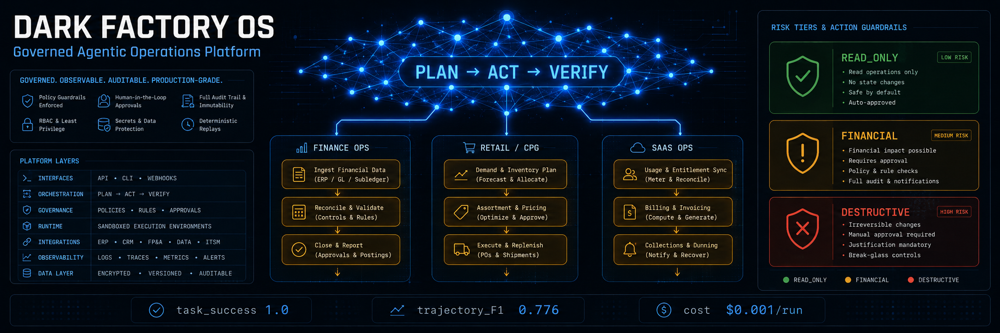
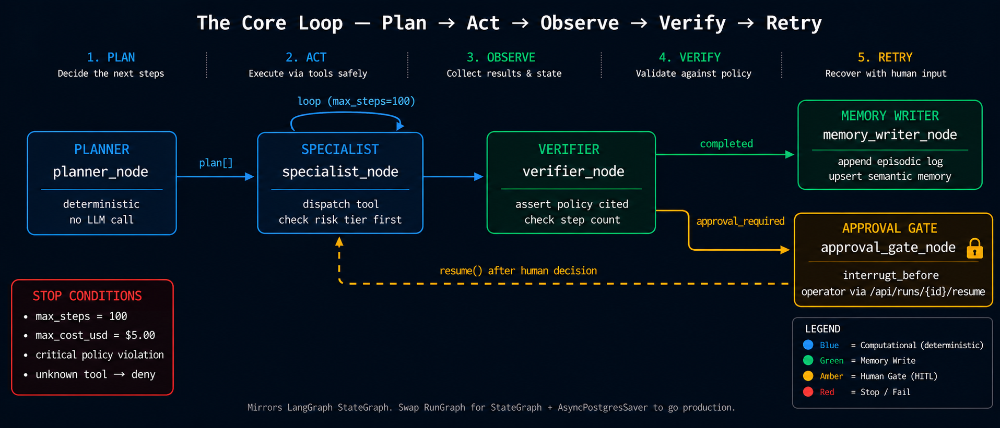
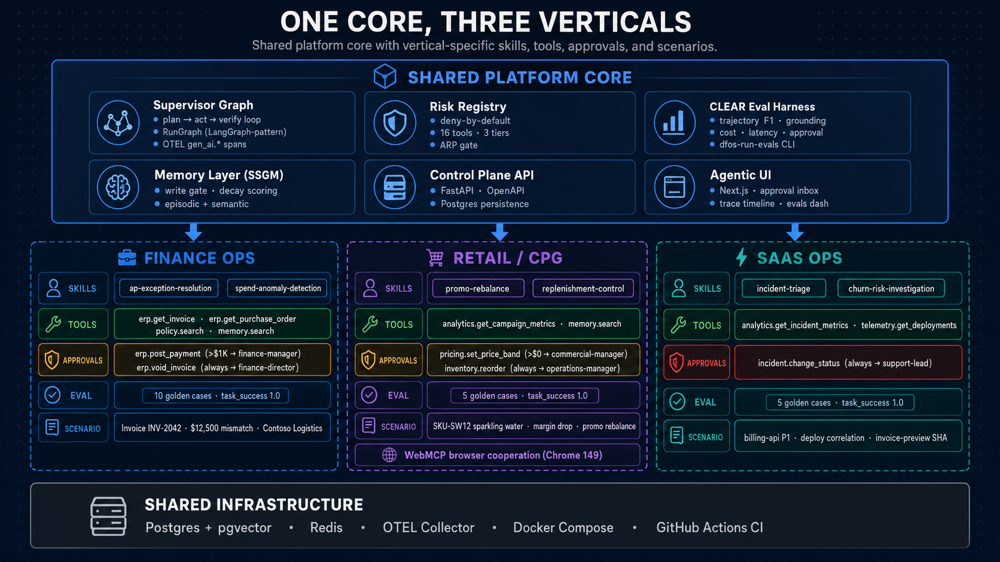
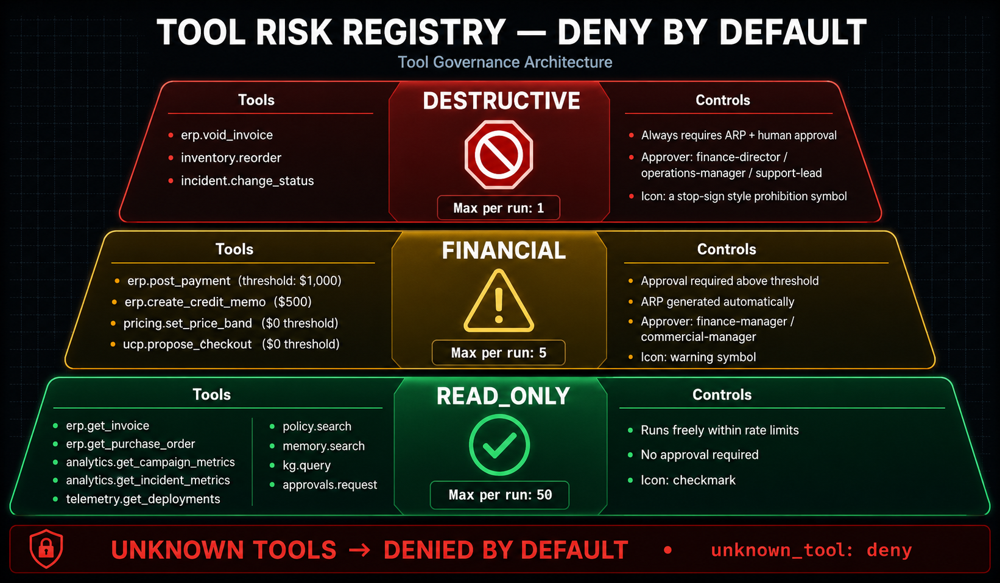
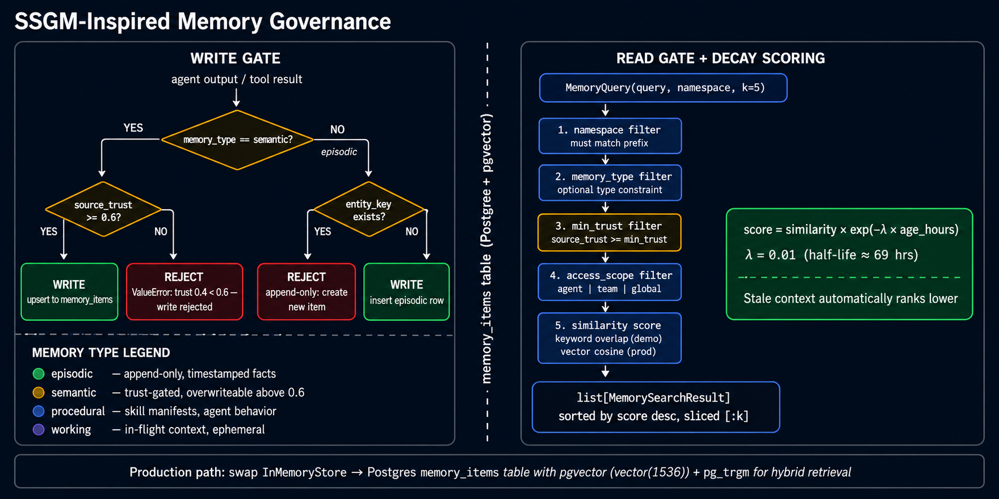
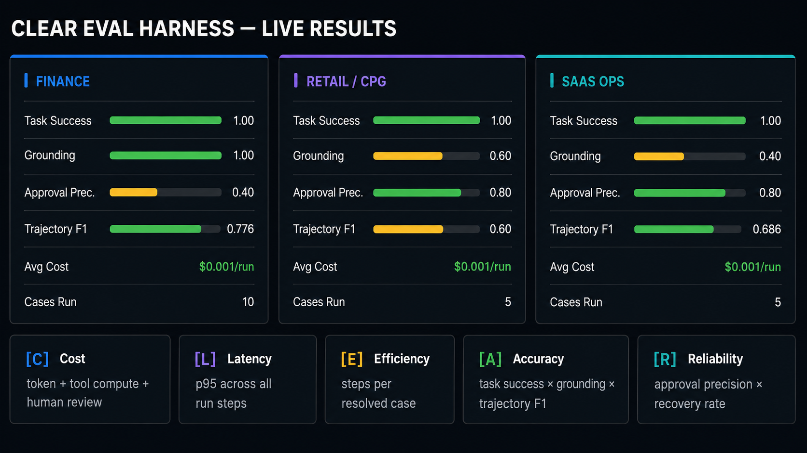
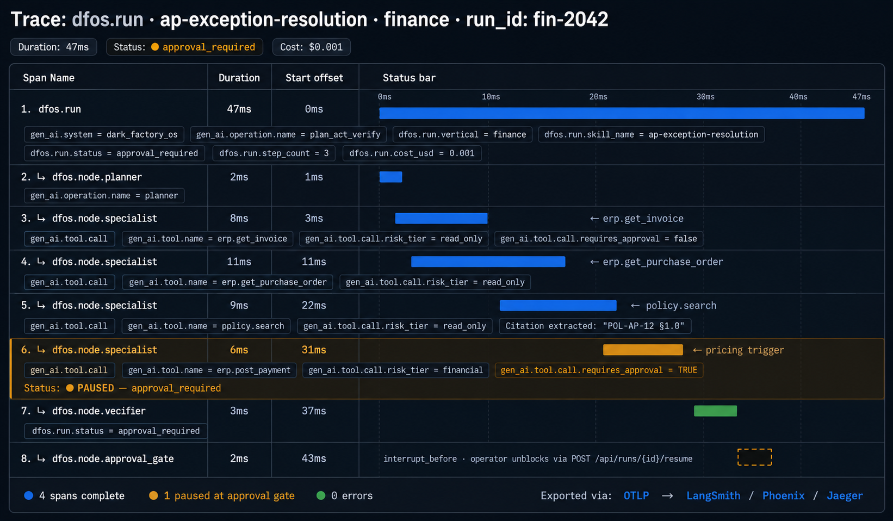
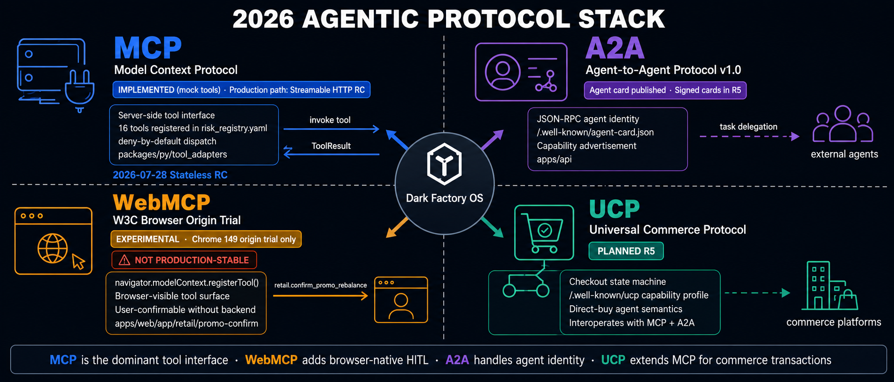

# Dark Factory OS

[](https://github.com/rrodenas3/dark-factory-os/actions/workflows/ci.yml)
[](#)
[](#)
[](#)



> **88% of AI proofs-of-concept never reach production.** Dark Factory OS is what bridges that gap: a governed agentic operations platform that makes autonomous AI measurable, auditable, and safe at enterprise scale.

Dark Factory OS is a spec-first flagship monorepo for AI transformation, agentic engineering, and applied AI roles. It presents a complete blueprint for an AI-native enterprise control plane: a `plan→act→observe→verify→retry` supervisor, specialist agents per vertical, a portable SKILL.md skill registry, a SSGM-inspired memory layer, MCP tool adapters, an approval inbox, CLEAR evals, OTEL GenAI semantic-convention tracing, cost controls, and a personalized agentic UI.

---

## What This Repo Proves

| Signal | Evidence in code |
|---|---|
| Enterprise agent architecture | LangGraph-pattern supervisor + specialist graph (`packages/py/orchestration`) |
| Governed autonomy | Risk registry: read\_only / financial / destructive tiers; deny-by-default; ARP gate |
| Memory governance | SSGM-inspired `InMemoryStore` with decay scoring, trust-gated write gate, append-only episodic log |
| Protocol literacy | MCP tool dispatch; A2A agent card; WebMCP browser experiment; UCP-ready commerce |
| Eval discipline | CLEAR harness: trajectory F1, grounding, approval precision, cost, p95 latency |
| Observability | OTEL `gen_ai.*` semantic conventions wired across all 5 graph nodes |
| AI transformation judgment | One platform → three enterprise verticals without rewriting the core |
| FDE readiness | Domain-realistic workflows that map directly to customer-facing implementation |

---

## The Core Loop



The supervisor runs a five-node deterministic graph. Every run follows the same path; only the tools called and the policy checked change per vertical.

```
planner_node    — resolves tool sequence from SKILL.md manifest (computational, no LLM call)
specialist_node — dispatches tool calls; checks risk tier BEFORE calling; loops up to max_steps
verifier_node   — asserts policy was cited; sets outcome.resolved and outcome.policy_cited
approval_gate   — pauses run (interrupt_before); operator unblocks via POST /api/runs/{id}/resume
memory_writer   — appends outcome to episodic log; upserts semantic memory through write-gate
```

**Stop conditions enforced on every run:** `max_steps = 100` · `max_cost_usd = $5.00` · critical policy violation · unknown tool → deny.

---

## One Core, Three Verticals



The same supervisor, memory layer, risk registry, and eval harness powers three distinct enterprise domains. Switching verticals means swapping `SKILL.md` files, tool contracts, and golden datasets — not the control plane.

| Vertical | Hero Skills | Approval path |
|---|---|---|
| **Finance Ops** | `ap-exception-resolution` · `spend-anomaly-detection` | `erp.post_payment` → finance-manager; `erp.void_invoice` → finance-director |
| **Retail / CPG** | `promo-rebalance` · `replenishment-control` | `pricing.set_price_band` → commercial-manager; `inventory.reorder` → operations-manager |
| **SaaS Ops** | `incident-triage` · `churn-risk-investigation` | `incident.change_status` → support-lead |

---

## Risk Registry and Tool Governance



`packages/py/governance/risk_registry.yaml` is the single source of truth for every tool permission. The loop checks the registry **before** executing any tool call — not after.

```yaml
unknown_tool: deny      # anything not listed is blocked at the gate
default_policy: strict
```

| Tier | Tools | Gate |
|---|---|---|
| `read_only` (9 tools) | `erp.get_invoice` · `erp.get_purchase_order` · `policy.search` · `memory.search` · `analytics.*` · `kg.query` · `approvals.request` · `telemetry.get_deployments` | Runs freely within rate limits |
| `financial` (4 tools) | `erp.post_payment` ($1 K) · `erp.create_credit_memo` ($500) · `pricing.set_price_band` · `ucp.propose_checkout` | Approval required above threshold; ARP auto-generated |
| `destructive` (3 tools) | `erp.void_invoice` · `inventory.reorder` · `incident.change_status` | Always requires ARP + human approval |

This is the canonical lesson from the `terraform destroy` incident: powerful tools plus weak gates can erase production state. Unknown tools are denied at classification time, not discovered at runtime.

---

## Memory and GraphRAG



The memory layer (`packages/py/memory`) implements SSGM-inspired governance across four memory types:

| Type | Behavior |
|---|---|
| **episodic** | Append-only, timestamped facts — no overwrite ever |
| **semantic** | Trust-gated (`source_trust ≥ 0.6`); overwriteable above threshold |
| **procedural** | Skill manifests and agent behavior patterns |
| **working** | In-flight context; ephemeral, not persisted |

**Decay scoring:** `score = similarity × exp(−λ × age_hours)` where `λ = 0.01` (half-life ≈ 69 hrs). Stale context automatically ranks lower without any manual pruning.

**Production path:** set `DFOS_PERSIST_RUNS=true` to use the `memory_items` Postgres table with `pgvector(1536)` and governed read/write gates. Docker Compose also opts the API and worker into LangGraph's native Postgres checkpointer with `DFOS_LANGGRAPH_CHECKPOINTS=postgres`, while local tests default to deterministic in-memory checkpoints. Optional graph sidecar (`kg_entities` / `kg_edges` tables) models vendor, invoice, policy, campaign, and incident relationships for explainable cross-entity retrieval.

---

## Observability and Evals

### CLEAR Eval Harness — Live Results



The eval system follows **CLEAR** — five dimensions measured on every run, not just at demo time:

| Dimension | What it measures |
|---|---|
| **C**ost | Token + tool compute + human review; tracked per run in `cost_ledger` |
| **L**atency | p95 across all run steps; `latency_ms` on every `run_steps` row |
| **E**fficiency | Steps and tool calls per successfully resolved case |
| **A**ccuracy | `task_success × grounding (policy cited) × trajectory F1` |
| **R**eliability | `approval_precision × recovery_rate` across approval decisions |

### OTEL GenAI Trace — Finance AP Exception Run



Every node, every tool call, and every approval event is instrumented with OpenTelemetry `gen_ai.*` semantic conventions. The span hierarchy:

```
dfos.run                          ← root span; gen_ai.system, gen_ai.operation.name, vertical, skill
  dfos.node.planner
  dfos.node.specialist            ← gen_ai.tool.call events per dispatch (risk_tier, requires_approval)
  dfos.node.specialist            ← loops until stop condition
  dfos.node.verifier
  dfos.node.approval_gate         ← emitted when status == approval_required
```

Traces export via OTLP to LangSmith, Phoenix, or Jaeger — no vendor lock-in.

---

## 2026 Agentic Protocol Stack



| Protocol | Where | Status |
|---|---|---|
| **MCP** (Stateless RC, 2026-07-28) | `packages/py/tool_adapters` | 16 mock tools registered; production path: Streamable HTTP RC |
| **A2A v1.0** | `apps/api/.well-known/agent-card.json` | Agent card published; signed cards in R5 |
| **WebMCP** (W3C origin trial) | `apps/web/app/retail/promo-confirm` | Experimental — Chrome 149 origin trial only, not production-stable |
| **UCP** (commerce) | Planned R5 | Checkout state machine; `/.well-known/ucp` capability profile |

MCP is the dominant tool interface. WebMCP adds browser-native HITL. A2A handles agent identity. UCP extends MCP for commerce transactions.

---

## Quickstart

```bash
cp .env.example .env
docker compose up --build
open http://localhost:3000      # agentic UI + approval inbox
open http://localhost:8000/docs # OpenAPI control plane
```

The first spine is intentionally minimal: Postgres + pgvector, Redis, FastAPI, Next.js. Temporal and the full OTEL collector are staged for R5 once the core control plane is healthy.

---

## Skills System

Skills live under `skills/{vertical}/{skill}/SKILL.md`. Each skill declares required/optional tools, memory reads/writes, triggers, risk tier, owner, and eval suite — validated at CI time against the risk registry.

```
skills/
  finance/
    ap-exception-resolution/SKILL.md    ← 4 required tools, medium risk, finance_goldens eval
    spend-anomaly-detection/SKILL.md
  retail/
    promo-rebalance/SKILL.md
    replenishment-control/SKILL.md
  saas/
    incident-triage/SKILL.md
    churn-risk-investigation/SKILL.md
```

Agents may propose skill improvements via `SkillImprovementProposal` artifacts, but publishing requires passing evals and a human review PR — never autonomous self-modification without a gate.

---

## Governance and Approvals

Every user, agent, tool call, run, approval, memory write, and cost event is attributable:

```
users(role) → agents(risk_tier, budget_daily_usd) → runs(vertical, briefing_json)
runs → run_steps(step_type, risk_tier, span_json)
runs → approvals(arp_json, approver_role, decision)
runs → cost_ledger(category, amount_usd)
audit_events(actor_type, actor_id, event_type)
```

HITL via `approval_gate_node` (mirrors LangGraph `interrupt_before`). Operator unblocks via `POST /api/runs/{id}/resume`. Approval decisions are persisted and surfaced in the Next.js approval inbox before the run continues.

---

## Cost Model

```text
run_cost      = model_tokens + retrieval + tool_compute + storage + observability + human_review
workflow_cost = run_cost × average_runs_per_case + downstream_actions
value_ratio   = business_value_created / workflow_cost
```

Tracks **operational spend** (tokens, compute) separately from **transactional spend** (ERP writes, pricing changes) — the distinction Ramp's 2026 finance agent guidance treats as non-negotiable for production systems.

---

## Repository Layout

```
dark-factory-os/
  apps/
    api/              FastAPI control plane — runs, approvals, skills, memory, evals, costs
    web/              Next.js agentic UI — dashboard, traces, approval inbox, CLEAR evals
    worker/           Durable job runner (Temporal in R5)
  packages/py/
    governance/       Risk registry — tool tiers, approval thresholds, default policy
    tool_adapters/    MCP-style dispatch + 16 mock enterprise tools
    orchestration/    plan→act→verify loop; RunGraph (LangGraph-pattern StateGraph) + OTEL
    memory/           SSGM-inspired store — write gates, decay scoring, episodic log
    skills_registry/  SKILL.md loader + validator (name↔dir, required tools vs risk registry)
    artifacts/        BriefingScript, LoopScript, ARP, SkillImprovementProposal schemas
    evals/            CLEAR harness — trajectory F1, grounding, approval precision, cost
    persistence/      asyncpg RunRepository, ApprovalRepository, migration runner
  apps/worker/        RunExecutor — claim/lease pattern, FOR UPDATE SKIP LOCKED
  skills/
    finance/ retail/ saas/   Six SKILL.md files, validated at CI time
  evals/datasets/     20 golden cases across three verticals
  infra/migrations/   Full Postgres schema (pgvector, audit_events, cost_ledger, kg_edges)
  docs/
    assets/           Visual diagrams and architecture images
    architecture/     System and agent architecture docs
    specs/            Per-package spec contracts
    protocols/        MCP · WebMCP · A2A · UCP protocol maps
    threat-model/     OWASP LLM / MITRE ATLAS-informed threat model
    research/         2026 stack research + vision documents
    recruiter-one-pager.md
```

---

## Roadmap

| Release | Deliverable | Status |
|---|---|---|
| **R0** | Research, architecture docs, protocol maps, narrative | ✅ Done |
| **R1** | Specs, schemas, risk registry, skills, eval datasets | ✅ Done |
| **R2** | Docker spine: API, web, Postgres, Redis | ✅ Done |
| **R3** | Tool adapters, memory store, orchestration graph, CLEAR eval harness | ✅ Done |
| **R4** | OTEL `gen_ai.*` tracing, memory → Postgres wiring, worker claim/lease | ✅ Done |
| **R5** | Temporal worker, signed A2A card, WebMCP Chrome origin trial, UCP simulator | Planned |
| **R6** | GraphRAG Neo4j sidecar, skill self-improvement PR loop | Planned |
| **R7** | Screenshots, demo video, benchmark report, blog post, public launch | Planned |

---

## Why This Matters

Most AI demos show model cleverness. Dark Factory OS shows **operational trustworthiness**: durable state, typed tools, governed autonomy, human review, measurable quality, and reusable vertical packs. That is the difference between a copilot demo and an AI-native enterprise operating model.

The repo follows the emerging consensus across official platform guidance (OpenAI, LangGraph, Microsoft Foundry, Google ADK): start with bounded workflow autonomy, typed tools, and continuous evals — treat identity, approvals, and observability as architecture, not afterthoughts.

---

## Research

- [`docs/research/vision.md`](docs/research/vision.md) — Product vision and architecture rationale
- [`docs/research/2026-stack-research.md`](docs/research/2026-stack-research.md) — Primary-source 2026 AI stack sweep (LangGraph, MCP, A2A, WebMCP, SSGM, Temporal, CLEAR)
