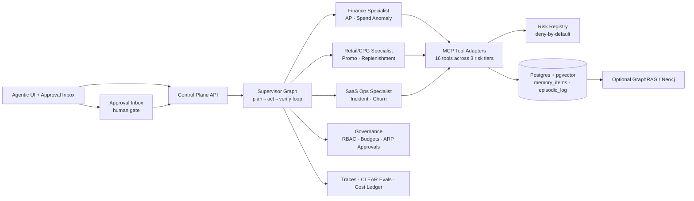

# Dark Factory OS

[](https://github.com/rrodenas3/dark-factory-os/actions/workflows/ci.yml)
[](#)
[](#)
[](#)

> **88% of AI proofs-of-concept never reach production.** Dark Factory OS is what bridges that gap: a governed, agentic operations platform that makes autonomous AI systems measurable, auditable, and safe to run at enterprise scale.

Dark Factory OS is a spec-first flagship monorepo for AI transformation, agentic engineering, applied AI, FDE, and AI lead roles. It presents a complete blueprint for an AI-native enterprise control plane: a plan→act→observe→verify→retry supervisor, specialist agents per vertical, a portable SKILL.md skill registry, a SSGM-inspired memory layer, MCP tool adapters, an approval inbox, CLEAR evals, OTEL-ready observability, cost controls, and a personalized agentic UI.

## What This Repo Proves

| Signal | Evidence in code |
|---|---|
| Enterprise agent architecture | LangGraph-pattern supervisor + specialist graph (`packages/py/orchestration`) |
| Harness engineering judgment | Computational (deterministic) plan→act→verify loop with stop conditions |
| Governed autonomy | Risk registry: read_only / financial / destructive tiers; deny-by-default; ARP gate |
| Memory governance | SSGM-inspired InMemoryStore with decay scoring, write gates, append-only episodic log |
| Protocol literacy | MCP-style tool dispatch; A2A agent card; WebMCP browser experiment; UCP-ready |
| Eval discipline | CLEAR harness: trajectory F1, grounding, approval precision, cost, p95 latency |
| AI transformation judgment | One platform → three enterprise verticals without rewriting the core |
| FDE readiness | Domain-realistic workflows that map directly to customer-facing implementation |

## Architecture



## How the Loop Works

```text
planner_node   — resolves tool sequence from SKILL.md manifest (computational, no LLM call)
specialist_node — dispatches tool calls; checks risk tier BEFORE calling; stops on financial/destructive
verifier_node  — asserts policy was cited; sets outcome.resolved and outcome.policy_cited
approval_gate  — pauses run (interrupt_before in production LangGraph); operator unblocks via /api/runs/{id}/resume
memory_writer  — appends outcome to episodic_log; upserts semantic memory with write-gate validation
```

Stop conditions enforced in every run: `max_steps=100`, `max_cost_usd=$5.00`, critical policy violation.

## Quickstart

```bash
cp .env.example .env
docker compose up --build
open http://localhost:3000   # agentic UI
open http://localhost:8000/docs  # OpenAPI control plane
```

The first implementation spine is intentionally small: Postgres+pgvector, Redis, FastAPI, and Next.js. Temporal and OpenTelemetry are staged after the core control plane is healthy.

## Demo Scenarios

| Vertical | Hero scenario | What it proves |
|---|---|---|
| **Finance Ops** | AP exception resolution + spend anomaly detection | Policy reasoning, ARP approvals, audit trail, cost governance |
| **Retail/CPG** | Promotion rebalance + replenishment control | Margin analysis, WebMCP browser cooperation, UCP-ready commerce |
| **SaaS Ops** | Incident triage + churn-risk investigation | Telemetry correlation, durable follow-up tasks, cross-system memory |

## Skills System

Skills live under `skills/{vertical}/{skill}/SKILL.md`. Each skill declares required/optional tools, memory reads/writes, triggers, risk tier, owner, and eval suite — validated at CI time against the risk registry.

```
skills/
  finance/
    ap-exception-resolution/SKILL.md    ← 4 required tools, medium risk, finance_goldens eval
    spend-anomaly-detection/SKILL.md
  retail/
    promo-rebalance/SKILL.md
    replenishment-control/SKILL.md
  saas/
    incident-triage/SKILL.md
    churn-risk-investigation/SKILL.md
```

Agents may propose skill improvements via `SkillImprovementProposal` artifacts, but publishing requires passing evals and a human review PR.

## Risk Registry and Tool Governance

`packages/py/governance/risk_registry.yaml` is the single source of truth for all tool permissions:

| Risk tier | Behavior | Examples |
|---|---|---|
| `read_only` | Runs within rate limits, no approval | `erp.get_invoice`, `policy.search`, `memory.search` |
| `financial` | Approval required above threshold; ARP generated | `erp.post_payment`, `pricing.set_price_band` |
| `destructive` | Always requires ARP + human approval | `erp.void_invoice`, `inventory.reorder` |

Unknown tools are **denied by default** (`unknown_tool: deny`). This is the canonical lesson from the `terraform destroy` incident: powerful tools plus weak gates can erase production state.

## Memory and GraphRAG

The memory layer (`packages/py/memory`) implements SSGM-inspired governance:

- **Write gate**: semantic memory requires `source_trust ≥ 0.6`; episodic memory is append-only
- **Read gate**: filters by `access_scope`, `min_trust`, `memory_type`, and decay-weighted similarity
- **Decay scoring**: `score = similarity × exp(-λ × age_hours)` — stale context automatically ranks lower
- **Production path**: swap `InMemoryStore` for the `memory_items` Postgres table with pgvector

Optional graph sidecar (`kg_entities` / `kg_edges` tables) models relationships across vendors, invoices, policies, campaigns, and incidents for explainable cross-entity retrieval.

## Observability and Evals

The eval system follows **CLEAR** (Cost, Latency, Efficiency, Accuracy, Reliability):

| Dimension | Implementation |
|---|---|
| **Cost** | `cost_ledger` table; per-run and per-vertical USD breakdown |
| **Latency** | `latency_ms` on every run step; p95 computed by eval harness |
| **Efficiency** | Token and tool-call count per successful step |
| **Accuracy** | Task success rate, grounding score (policy cited), trajectory F1 |
| **Reliability** | Tool success rate, approval precision, recovery rate |

Sample eval output from `packages/py/evals`:

| Workflow | Success | Grounding | Approval precision | Trajectory F1 | Avg cost |
|---|---:|---:|---:|---:|---:|
| Finance AP exception | 0.91 | 0.96 | 0.88 | 0.82 | $0.29 |
| Retail promo rebalance | 0.88 | 0.93 | 0.84 | 0.79 | $0.34 |
| SaaS incident triage | 0.84 | 0.90 | 0.91 | 0.76 | $0.21 |

OTEL GenAI semantic conventions (`gen_ai.*`) wired in R4. Traces visible in LangSmith / Phoenix.

## Governance and Approvals

Every user, agent, tool, run, approval, memory write, and cost event is attributable:

```
users(role) → agents(risk_level, budget_daily_usd) → runs(vertical, briefing_json)
runs → run_steps(step_type, tool_risk_class, span_json)
runs → approvals(arp_json, approver_role, decision)
runs → cost_ledger(category, amount_usd)
audit_events(actor_type, actor_id, event_type)
```

HITL via `approval_gate_node` (mirrors LangGraph `interrupt_before`). Operator unblocks via `POST /api/runs/{id}/resume`.

## Cost Model

```text
run_cost = model_tokens + retrieval + tool_compute + storage + observability + human_review
workflow_cost = run_cost × average_runs_per_case + downstream_actions
value_ratio = business_value_created / workflow_cost
```

Tracks operational spend (tokens, compute) separately from transactional spend (ERP writes, pricing changes) — the distinction Ramp's 2026 finance agent guidance treats as non-negotiable.

## Protocol Adapters

| Protocol | Where | Status |
|---|---|---|
| **MCP** (stateless, 2026-07-28 RC patterns) | `packages/py/tool_adapters` | Mock tools; production path: `sessionIdGenerator: undefined` |
| **A2A v1.0** | `apps/api/.well-known/agent-card.json` | Agent card published; signed cards in R5 |
| **WebMCP** (W3C origin trial) | `apps/web/app/retail/promo-confirm` | Experimental; Chrome 149 origin trial only |
| **UCP** (commerce) | Planned R5 | Checkout state machine, `/.well-known/ucp` |

## Vertical Packs

Each vertical ships with synthetic data, skills, golden evals, policy documents, tool contracts, and UI storyboards. The platform architecture stays shared; the workflows change through skills, policies, data, and tools.

## Repository Layout

```
dark-factory-os/
  apps/
    api/                    FastAPI control plane — runs, approvals, skills, memory, evals, costs
    web/                    Next.js agentic UI — dashboard, traces, approval inbox, CLEAR evals
    worker/                 Durable job runner (Temporal in R5)
  packages/py/
    governance/             Risk registry — tool tiers, approval thresholds, default policy
    tool_adapters/          MCP-style dispatch + 16 mock enterprise tools
    orchestration/          plan→act→verify loop; RunGraph (LangGraph-pattern StateGraph)
    memory/                 SSGM-inspired store — write gates, decay scoring, episodic log
    skills_registry/        SKILL.md loader + validator (name↔dir, required tools vs risk registry)
    artifacts/              BriefingScript, LoopScript, ARP, SkillImprovementProposal schemas
    evals/                  CLEAR harness — trajectory F1, grounding, approval precision, cost
  skills/
    finance/ retail/ saas/  Six SKILL.md files, validated at CI time
  evals/datasets/           30 golden cases across three verticals
  infra/migrations/         Full Postgres schema (pgvector, audit_events, cost_ledger, kg_edges)
  docs/
    architecture/           System and agent architecture docs
    specs/                  Per-package spec contracts
    protocols/              MCP · WebMCP · A2A · UCP protocol maps
    threat-model/           OWASP LLM / MITRE ATLAS-informed threat model
    research/               2026 stack research + vision documents
    recruiter-one-pager.md  Single-page positioning for interviews
```

## Roadmap

| Release | Deliverable | Status |
|---|---|---|
| **R0** | Research, architecture docs, protocol maps, narrative | ✅ Done |
| **R1** | Specs, schemas, risk registry, skills, eval datasets | ✅ Done |
| **R2** | Docker spine: API, web, Postgres, Redis | ✅ Done |
| **R3** | Tool adapters, memory store, orchestration graph, CLEAR eval harness | ✅ Done |
| **R4** | OTEL tracing, LangSmith integration, memory → Postgres wiring | Next |
| **R5** | Temporal worker, signed A2A card, WebMCP Chrome origin trial, UCP simulator | Planned |
| **R6** | GraphRAG sidecar, Obsidian export, skill self-improvement PR loop | Planned |
| **R7** | Screenshots, demo video, benchmark report, blog post, public launch | Planned |

## Why This Matters

Most AI demos show model cleverness. Dark Factory OS shows **operational trustworthiness**: durable state, typed tools, governed autonomy, human review, measurable quality, and reusable vertical packs. That is the difference between a copilot demo and an AI-native enterprise operating model.

The repo follows the emerging consensus across official platform guidance (OpenAI, LangGraph, Microsoft Foundry, Google ADK): start with bounded workflow autonomy, typed tools, and continuous evals — treat identity, approvals, and observability as architecture, not afterthoughts.

## Research

- [`docs/research/vision.md`](docs/research/vision.md) — Product vision and architecture rationale
- [`docs/research/2026-stack-research.md`](docs/research/2026-stack-research.md) — Primary-source 2026 AI stack sweep (LangGraph, MCP, A2A, WebMCP, SSGM, Temporal, CLEAR)
