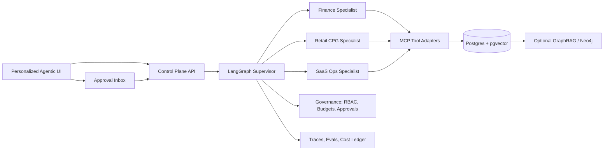

# Dark Factory OS

[](#) [](#) [](#) [](#)

88% of AI proofs-of-concept never reach production. Dark Factory OS is what bridges that gap: a governed, agentic operations platform that makes autonomous AI systems measurable, auditable, and safe to run at enterprise scale.

Dark Factory OS is a spec-first flagship repository for AI transformation, agentic engineering, applied AI, FDE, and AI lead roles. It presents a complete blueprint for an AI-native enterprise control plane: supervisor agents, specialist workflows, portable skills, MCP tools, memory, knowledge graphs, approvals, evals, observability, cost controls, and personalized agentic UI.

## What This Repo Proves

- Enterprise agent architecture: stateful orchestration, typed tools, durable jobs, human gates, and traceable outcomes.
- AI transformation judgment: finance, retail/CPG, and SaaS operations built on one reusable platform.
- Agentic engineering depth: loop policies, skills, memory governance, evals, self-improvement, and protocol adapters.
- FDE readiness: synthetic but realistic enterprise workflows that map to customer-facing implementation work.
- Governance maturity: RBAC, tool risk classes, approvals, audit trails, cost controls, and threat modeling.
- Product craft: personalized control-room UI, approval inboxes, trace timelines, dashboards, and infographic-ready narrative.

## Architecture



The system is organized as six layers:

| Layer | Purpose |
|---|---|
| Research and narrative | Market thesis, architecture, protocol maps, infographics, recruiter one-pager |
| Control plane | Runs, approvals, skills, audit, costs, memory, evals |
| Agent runtime | Plan-act-observe-verify-retry supervisor and specialists |
| Tools and protocols | MCP, WebMCP experiment, A2A card, UCP-style commerce simulator |
| Knowledge and memory | Postgres, pgvector, optional GraphRAG, Obsidian-compatible knowledge export |
| Evaluation and improvement | CLEAR metrics, golden datasets, traces, self-improving skill proposals |

## Quickstart

```bash
cp .env.example .env
docker compose up --build
open http://localhost:3000
```

The first implementation spine is intentionally small: Postgres, Redis, FastAPI, and Next.js. Temporal, OpenTelemetry, and graph services are staged after the core control plane is healthy.

## Demo Scenarios

| Vertical | Hero scenario | Signal |
|---|---|---|
| Finance Ops | AP exception resolution and spend anomaly detection | Policy reasoning, approvals, audit, cost control |
| Retail/CPG | Promotion rebalance and replenishment control | Agentic commerce, WebMCP, UCP-style workflows |
| SaaS Ops | Incident triage and churn-risk investigation | Long-running ops, telemetry correlation, follow-up tasks |

## Skills System

Skills live under `skills/{vertical}/{skill}/SKILL.md`. Each skill declares its tools, memory reads/writes, triggers, risk tier, and eval suite. Agents may propose skill improvements, but publishing requires validation, evals, and human review.

## Memory and GraphRAG

The baseline memory layer uses Postgres plus pgvector. It separates working, episodic, semantic, and procedural memory. The optional graph sidecar models relationships across vendors, invoices, policies, campaigns, products, customers, incidents, services, and accounts.

## Observability and Evals

The eval system follows CLEAR:

| Dimension | Meaning |
|---|---|
| Cost | USD per run and per successful outcome |
| Latency | p50/p95 workflow and step latency |
| Efficiency | tokens and tool calls per successful step |
| Accuracy | task success, grounding, policy compliance |
| Reliability | tool success, recovery, duplicate-action prevention |

Sample target dashboard:

| Workflow | Success | Grounding | Approval rate | Avg cost | p95 latency | Notes |
|---|---:|---:|---:|---:|---:|---|
| Retail promo rebalance | 0.88 | 0.93 | 0.31 | $0.34 | 14.8s | Good, approvals slightly high |
| Finance AP exception | 0.91 | 0.96 | 0.42 | $0.29 | 11.2s | Safe but conservative |
| SaaS incident triage | 0.84 | 0.90 | 0.18 | $0.21 | 8.5s | Needs better KB coverage |

## Governance and Approvals

Every user, agent, tool, run, approval, memory write, and cost event is attributable. Read-only tools can proceed without approval. Financial tools use thresholds. Destructive tools always require a human gate and an ActionReadinessPack.

## Cost Model

```text
run_cost = model_tokens + retrieval + tool_compute + storage + observability + human_review
workflow_cost = run_cost * average_runs_per_case + downstream_actions
value_ratio = business_value_created / workflow_cost
```

## Vertical Packs

Each vertical ships with synthetic data, skills, golden evals, policy documents, tool contracts, and UI storyboards. The platform architecture stays shared; the workflows change through skills, policies, data, and tools.

## Screenshots and Traces

Planned visual assets live in `docs/infographics/README.md`. The intended launch set is: architecture diagram, agent loop, approval flow, memory graph, protocol map, eval dashboard, and a three-vertical control-room montage.

## Roadmap

| Release | Deliverable |
|---|---|
| R0 | Research-first repo, architecture docs, protocol maps, recruiter narrative |
| R1 | Specs, schemas, risk registry, skills, synthetic eval datasets |
| R2 | Minimal Docker spine: API, web, Postgres, Redis |
| R3 | Finance, retail, and SaaS workflows runnable against mock tools |
| R4 | Evals, traces, memory governance, cost dashboard |
| R5 | Temporal jobs, WebMCP experiment, UCP simulator, A2A card |
| R6 | GraphRAG sidecar, Obsidian export, skill improvement PR loop |
| R7 | Launch polish: screenshots, demo video, benchmark report, blog post |

## Why This Matters

Most AI demos show model cleverness. Dark Factory OS shows operational trustworthiness: durable state, typed tools, governed autonomy, human review, measurable quality, and reusable vertical packs. That is the difference between a copilot demo and an AI-native enterprise operating model.
