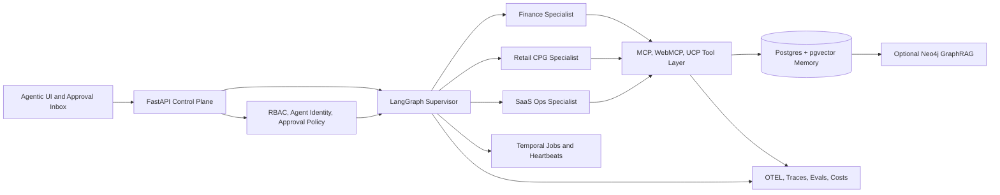

# Dark Factory OS Architecture

Dark Factory OS is a governed agentic operations platform for AI-native enterprise workflows. It turns agent autonomy into an auditable operating system: one control plane, one supervisor runtime, typed tools, portable skills, governed memory, knowledge graph context, approvals, evals, traces, and vertical workflow packs for finance, retail/CPG, and SaaS operations.

## System Diagram

## Stack

| Layer | Choice | Why |
|---|---|---|
| API | FastAPI + Pydantic | Explicit contracts and strong Python AI ecosystem |
| Orchestration | LangGraph | Stateful graphs, persistence, interrupts, human-in-the-loop |
| Durable jobs | Temporal | Crash-safe long-running workflows and cron-style heartbeats |
| UI | Next.js + React + Tailwind | Recruiter-legible product surface and agentic UI patterns |
| Database | Postgres + pgvector | Local-first operational store and semantic memory |
| Graph | Neo4j optional sidecar | Relationship-aware retrieval and visual knowledge demos |
| Tools | MCP | Standard agent-to-tool protocol |
| Browser tools | WebMCP experimental | Visible browser cooperation with user context |
| Commerce | UCP-style simulator | Agentic commerce signal for retail/CPG |
| Interop | A2A Agent Card | Agent discovery and cross-agent capability declaration |
| Observability | OTEL/OpenInference style | Trace-first evals, cost, and reliability monitoring |
| Skills | Agent Skills `SKILL.md` | Portable procedural memory and self-improving workflows |

## Six Proof Points

1. The repo models production-grade agent orchestration rather than a chatbot wrapper.
2. The same core platform powers finance, retail/CPG, and SaaS verticals.
3. Tool access is typed, risk-tagged, audited, and governed.
4. Memory and knowledge are separated into working, episodic, semantic, procedural, and graph layers.
5. Evals and traces are first-class product surfaces, not afterthought logs.
6. Agent self-improvement is PR-gated and measurable, not uncontrolled self-modification.

## Spec Index

- [Product Spec](../specs/product-spec.md)
- [System Spec](../specs/system-spec.md)
- [Agent Runtime Spec](../specs/agent-runtime-spec.md)
- [Governance Spec](../specs/governance-spec.md)
- [Memory and Knowledge Graph Spec](../specs/memory-kg-spec.md)
- [Skills Registry Spec](../specs/skills-registry-spec.md)
- [Evaluation Spec](../specs/evals-spec.md)
- [Agentic UI Spec](../specs/agentic-ui-spec.md)
- [Protocol Adapter Spec](../specs/protocol-adapters-spec.md)
