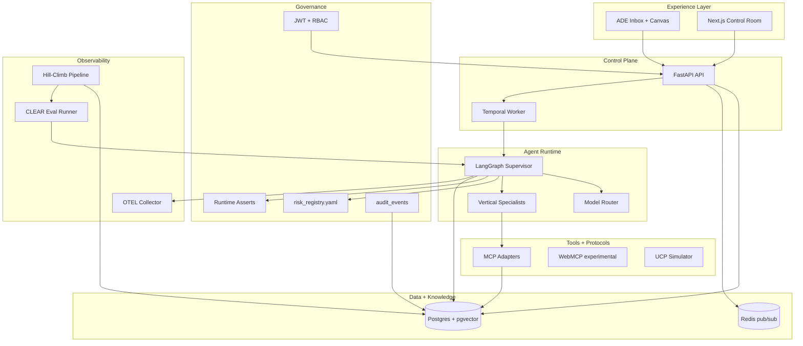
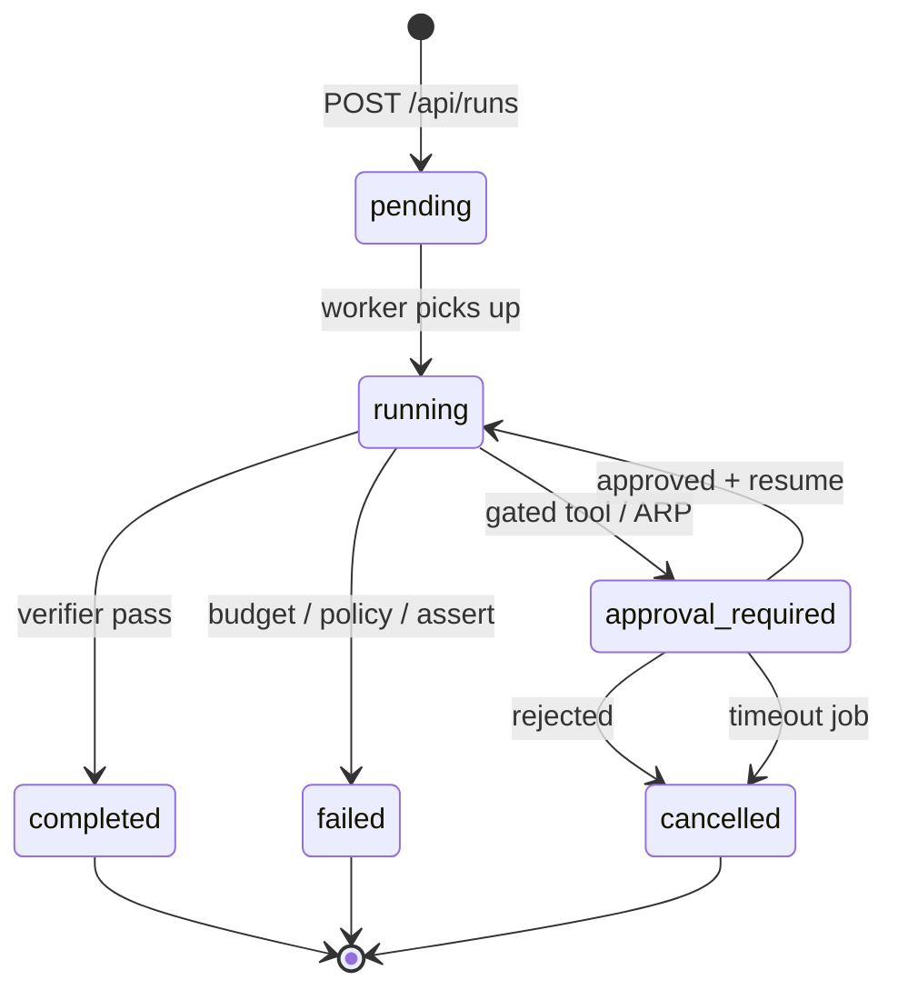
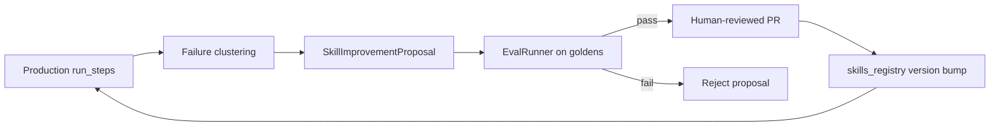

# feat: Enterprise agentic-native platform augmentation

## Summary

Transform Dark Factory OS from an R2 spec-first demo spine into a Nadella-credible **agentic enterprise operating model**: persisted runs with LangGraph interrupt/resume, Agent 365 governance, an ADE control-room UI, governed memory and OTEL traces, model-tier routing, MCP/Temporal protocols, and a closed eval hill-climbing loop that compounds tacit knowledge inside the tenant boundary.

## Problem Frame

The repo has strong contracts (OpenAPI, Postgres schema, SKILL.md, risk registry, CLEAR evals, deterministic `RunGraph`) but the **deployed stack is disconnected**: API uses in-memory demo data, web reads static `demo-data.ts`, orchestration runs only in pytest, worker is a placeholder, and trajectories never persist. Specs through R7 describe the target; implementation stops at R2.

Enterprise buyers and reviewers need **tangible proof** that human capital and token capital compound inside governed boundaries—not another static control-room mock.

## Requirements

### Control plane and persistence

- R1. Postgres is the system of record for runs, steps, approvals, audit events, cost ledger, and memory items.
- R2. Creating a run from the API enqueues orchestration; the HTTP handler returns 202 with a durable `run_id`.
- R3. Run lifecycle states match `infra/migrations/001_initial_schema.sql` and transition only through documented owners (API, worker, graph).
- R4. Financial and destructive tools follow proposal-first semantics: no side-effecting dispatch until human approval.

### Agent runtime

- R5. LangGraph replaces the harness `RunGraph` with Postgres checkpointing and `interrupt_before` on the approval gate.
- R6. Resume after approval executes exactly one gated tool from checkpoint, then verifier and memory writer.
- R7. Planner loads tool sequences from the skills registry, not hardcoded `_SKILL_PLANS`.
- R8. Model routing selects frontier vs efficient tiers per step with budget downgrade and cost attribution.

### Governance (Agent 365)

- R9. JWT auth and platform RBAC gate API mutations; business approver roles gate approval decisions.
- R10. Agents are registrable entities with inventory, budgets, and A2A agent card metadata.
- R11. Runtime asserts fire at run start and before financial/destructive tools (agent active, budget headroom, tool allowlist).
- R12. Every user, agent, and system action writes an attributable `audit_events` row.

### Experience layer (ADE)

- R13. Web UI reads live data from `NEXT_PUBLIC_API_URL`; demo-static mode is removable or flag-gated.
- R14. `/runs/[id]` renders TraceTimeline, cost breakdown, and ARP artifacts from persisted steps.
- R15. ADE inbox aggregates runs needing attention (approval, failed, stale running) with role filtering.
- R16. Cognitive coverage quiz is generated after run completion; advisory for medium risk, optional gate for critical ARPs.

### Memory, observability, evals

- R17. Memory reads/writes use Postgres + pgvector with existing write gates ported from `InMemoryStore`.
- R18. OTEL spans correlate to `run_steps.span_json`; CLEAR dashboard reads live eval and cost data.
- R19. Production trajectories feed eval hill-climbing: failure patterns produce validated `SkillImprovementProposal` artifacts.

### Protocols and durability

- R20. MCP adapters expose mock enterprise tools with typed schemas and risk metadata.
- R21. Temporal worker runs long-running SaaS workflows and approval timeouts.
- R22. A2A agent card is served at `/.well-known/agent-card.json`; WebMCP and UCP remain experimental and flag-gated.

### Deployment

- R23. Docker Compose runs postgres, redis, api, worker, web with uv workspace and pnpm builds.
- R24. CI continues to gate ruff, mypy, pytest, validators, and adds integration tests for the live spine.

---

## Key Technical Decisions

| ID | Decision | Rationale |
|---|---|---|
| KTD-1 | **Async execution via worker**, not synchronous API invoke | Long-running graphs and HITL waits must not block HTTP; aligns with `docs/specs/agent-runtime-spec.md` Temporal note |
| KTD-2 | **LangGraph + AsyncPostgresSaver** replaces harness; keep node logic | `RunGraph` nodes are portable; harness comment already targets this swap |
| KTD-3 | **Approval path**: `POST /api/approvals/{id}/decision` writes DB then resumes graph | Single source of truth; `/api/runs/{id}/resume` becomes internal or deprecated |
| KTD-4 | **Proposal-first gated tools** | Fix `specialist_node` dispatch-before-pause bug; matches AGENTS.md and threat model |
| KTD-5 | **Finance AP exception as pilot E2E vertical** | Richest golden dataset, clearest approval story, hero scenario in README |
| KTD-6 | **`packages/ts/api-client`** generated from OpenAPI | Eliminates ad-hoc fetch types; pnpm workspace slot is empty today |
| KTD-7 | **`model_routing.yaml` alongside `risk_registry.yaml`** | Nadella token-efficiency dictum: frontier only for planner/verifier/ARP narrative |
| KTD-8 | **Traces: `run_steps` for product UI, OTEL for deep debug** | Shared `trace_id` in `span_json`; UI does not depend on external collector |
| KTD-9 | **Skill improvement stays PR-gated** | Never auto-merge SKILL.md; eval pass is necessary not sufficient |
| KTD-10 | **GraphRAG Neo4j sidecar optional in compose profile** | SQL `kg_*` tables suffice for MVP; Neo4j behind `compose --profile graph` |

---

## High-Level Technical Design

### Target architecture

### Run lifecycle state machine

### Hill-climbing loop (token capital compounding)

---

## Scope Boundaries

### In scope

- Full wiring from UI through API, worker, LangGraph, Postgres, governance, memory, OTEL, evals, MCP mocks, Temporal for long runs, ADE inbox, cognitive coverage (advisory), model routing policy, skill improvement pipeline, Docker/CI hardening.

### Deferred for later (README R7 launch polish)

- Demo video, benchmark report, blog post, screenshot montage (`docs/infographics/README.md`).
- Production cloud IaC (Terraform/K8s/Render)—local compose plus CI only in this plan.

### Outside this product's identity

- Training custom foundation models or operating a model gym on customer trajectories.
- Replacing customer ERP/CRM systems—mock adapters remain the default.

### Deferred to follow-up work

- Tailwind migration (spec mentions Tailwind; app uses custom CSS—migrate only if UI refactor touches styling).
- Real LLM provider billing integration beyond cost ledger placeholders.
- Sovereign multi-region deployment patterns.

---

## Assumptions

- Pilot vertical: finance `ap-exception-resolution` for first end-to-end proof.
- LLM providers: Anthropic/OpenAI via env keys; abstraction layer hides vendor specifics.
- No upstream brainstorm doc; Nadella enterprise pillars (experience, hill-climbing, manageability) inform priorities.
- Existing deterministic evals remain passing during LangGraph migration (characterization tests first).

---

## Phased Delivery

| Phase | Roadmap | Outcome |
|---|---|---|
| A | R2.5 Spine | Live run create → graph → DB → UI |
| B | R4 Governance | Agent 365, auth, ARP, asserts |
| C | R4 Experience | ADE inbox, trace detail, API client |
| D | R4 Memory + OTEL | pgvector store, traces, CLEAR live |
| E | R4–R5 Intelligence | Model routing, skill loader, MCP |
| F | R5 Durability | Temporal, protocols, Redis realtime |
| G | R6 Hill-climb | Trace mining, skill PR loop |
| H | R6–R7 Graph + hardening | Optional Neo4j, deploy polish |

---

## Implementation Units

### U1. Postgres repository layer

- **Goal:** Shared async data access for runs, steps, approvals, audit, cost, memory.
- **Requirements:** R1, R3
- **Dependencies:** None
- **Files:** `packages/py/memory/pyproject.toml` (add asyncpg), new `packages/py/persistence/` or `apps/api/src/dark_factory_api/db/`, `tests/test_persistence.py`
- **Approach:** SQLAlchemy 2 async or asyncpg with explicit Pydantic row models matching migration. Repository pattern per aggregate (RunRepository, ApprovalRepository). Connection from `DATABASE_URL`.
- **Patterns to follow:** Pydantic models in `packages/py/memory/models.py`, schema in `infra/migrations/001_initial_schema.sql`
- **Test scenarios:**
  - Insert run with briefing_json; fetch by id returns matching status.
  - Append run_step with span_json; list by run_id ordered by created_at.
  - Approval row links to run_id; decision update sets decided_at.
  - Transaction rollback on partial step write leaves no orphan rows.
- **Verification:** Repository integration tests pass against CI Postgres service.

### U2. Fix proposal-first tool execution

- **Goal:** Financial/destructive tools never dispatch before approval.
- **Requirements:** R4
- **Dependencies:** None (can land before U5)
- **Files:** `packages/py/orchestration/src/dark_factory_orchestration/nodes.py`, `tests/test_orchestration.py`
- **Approach:** On financial/destructive tier, build ARP payload preview without calling `dispatch()`; set `pending_approval` and stop. After resume signal, dispatch once. Update golden eval expectations if tool_trace shape changes.
- **Execution note:** Extend characterization tests before changing specialist behavior.
- **Test scenarios:**
  - `pricing.set_price_band` run stops at approval_required with zero successful side-effect in mock output.
  - After simulated resume, exactly one dispatch for gated tool.
  - Read-only tools still dispatch immediately.
  - Unknown tool fails closed per risk registry.
- **Verification:** `uv run pytest tests/test_orchestration.py` green; finance goldens still pass trajectory checks.

### U3. LangGraph runtime with Postgres checkpoints

- **Goal:** Replace harness `RunGraph` with real LangGraph StateGraph and interrupt/resume.
- **Requirements:** R5, R6
- **Dependencies:** U1, U2
- **Files:** `packages/py/orchestration/pyproject.toml` (add langgraph, langgraph-checkpoint-postgres), `graph.py`, new `langgraph_builder.py`, `tests/test_orchestration.py`, `tests/test_langgraph_checkpoint.py`
- **Approach:** Port nodes unchanged; build StateGraph with edges matching harness loop; `interrupt_before=["approval_gate"]`; AsyncPostgresSaver with `thread_id=run_id`. Export `build_graph()` returning compiled graph.
- **Test scenarios:**
  - Invoke to interrupt pauses with status approval_required and checkpoint persisted.
  - Resume with approved decision completes with memory_writer invoked.
  - Resume with rejected decision transitions to cancelled without gated dispatch.
  - Budget exceeded mid-loop sets failed status.
- **Verification:** Checkpoint survives re-instantiation of graph builder in new process (integration test).

### U4. Worker execution service

- **Goal:** Async run execution decoupled from API.
- **Requirements:** R2, R3
- **Dependencies:** U1, U3
- **Files:** `apps/worker/pyproject.toml`, `apps/worker/src/dark_factory_worker/main.py`, new `executor.py`, `docker-compose.yml`, `apps/worker/Dockerfile`
- **Approach:** Worker polls Redis queue or Postgres `FOR UPDATE SKIP LOCKED` on pending runs. Invokes LangGraph; on interrupt updates run status; publishes Redis event for UI. Phase F upgrades queue to Temporal activities.
- **Test scenarios:**
  - Enqueued run transitions pending → running → terminal state.
  - API returns 202 immediately while worker processes.
  - Worker crash mid-run leaves run resumable from checkpoint.
- **Verification:** Docker compose worker container processes a test run end-to-end.

### U5. API integration (runs, approvals, trace)

- **Goal:** Replace in-memory demo with persisted orchestration-backed API.
- **Requirements:** R1–R4, R12
- **Dependencies:** U1, U4
- **Files:** `apps/api/src/dark_factory_api/main.py`, new modules `routes/runs.py`, `routes/approvals.py`, `services/run_service.py`, `apps/api/pyproject.toml`, `apps/api/tests/test_runs_integration.py`, `apps/api/Dockerfile`
- **Approach:** `POST /api/runs` validates BriefingScript, inserts run, enqueues worker. `GET /api/runs/{id}` includes steps. `POST /api/approvals/{id}/decision` validates RBAC stub then resumes graph. Deprecate or gate `/api/demo/*` behind env flag.
- **Test scenarios:**
  - POST run returns 201/202 and persisted row.
  - GET trace returns ordered steps with tool_name and risk_tier.
  - Approval decision on financial ARP triggers resume (mock worker in test).
  - Invalid skill_name returns 422.
- **Verification:** API integration tests with TestClient + test DB; health check unchanged.

### U6. JWT auth and RBAC middleware

- **Goal:** Enforce platform and business roles on mutations.
- **Requirements:** R9
- **Dependencies:** U5
- **Files:** `apps/api/src/dark_factory_api/auth.py`, `middleware.py`, `tests/test_auth.py`
- **Approach:** Bearer JWT from `JWT_SECRET`; claims map to platform role and optional business roles. Approvals require matching `approver_role`. Read endpoints allow viewer+.
- **Test scenarios:**
  - Unauthenticated POST /api/runs returns 401.
  - Viewer cannot approve; finance-manager can approve finance ARPs only.
  - Admin can list all runs; analyst can create runs.
- **Verification:** OpenAPI security scheme matches implementation.

### U7. Agent registry and runtime asserts

- **Goal:** Agent 365 inventory and fail-closed execution guards.
- **Requirements:** R10, R11
- **Dependencies:** U5, U6
- **Files:** `packages/py/governance/src/dark_factory_governance/asserts.py`, `apps/api/routes/agents.py`, `tests/test_agent_asserts.py`
- **Approach:** CRUD for `agents` table; bind `agent_id` on run create. Assert module checks: agent status active, daily budget, skill allowed tools ⊆ registry. Called from worker before graph invoke and before gated tools.
- **Test scenarios:**
  - Suspended agent cannot start new run.
  - Budget exceeded agent fails assert before next tool.
  - Agent card JSON served on agent detail endpoint.
- **Verification:** Assert failure writes audit_event and run status failed.

### U8. Audit and cost ledger writers

- **Goal:** Attributable audit trail and CLEAR cost categories on every step.
- **Requirements:** R12, R18
- **Dependencies:** U4, U5
- **Files:** `packages/py/governance/src/dark_factory_governance/audit.py`, orchestration nodes (cost hooks), `tests/test_audit_cost.py`
- **Approach:** Helper called from each node transition; cost_ledger categories from schema enum. Token costs from model router (U13) populate model_tokens category.
- **Test scenarios:**
  - Each tool call produces audit_event with actor_type agent.
  - Approval decision produces audit_event with actor_type user.
  - cost_ledger sums match run.total_cost_usd.
- **Verification:** Query `/api/audit/events` returns filtered events (once route implemented).

### U9. TypeScript API client package

- **Goal:** Typed web ↔ API contract.
- **Requirements:** R13
- **Dependencies:** U5
- **Files:** `packages/ts/api-client/package.json`, generated client from `apps/api/openapi.yaml`, root `pnpm-workspace.yaml`
- **Approach:** Use openapi-typescript or similar; export fetch wrappers with base URL from env. Single source for Run, Approval, Trace types.
- **Test scenarios:**
  - Generated types compile under strict TS.
  - Smoke test calls /health against mock server.
- **Verification:** `pnpm build` includes api-client.

### U10. Web live data wiring

- **Goal:** Replace static demo-data with API-driven pages.
- **Requirements:** R13
- **Dependencies:** U9
- **Files:** `apps/web/app/lib/api.ts`, `runs/page.tsx`, `approvals/page.tsx`, `skills/page.tsx`, `costs/page.tsx`, `evals/page.tsx`, `page.tsx`
- **Approach:** Server Components fetch where possible; client mutations for approvals. Loading and error states. Feature flag `NEXT_PUBLIC_DEMO_MODE` for launch screenshots fallback.
- **Test scenarios:**
  - Runs page lists API runs when demo mode false.
  - Approvals approve button calls decision endpoint and refreshes list.
  - Dashboard metrics derive from API summaries.
- **Verification:** Manual smoke with docker compose; optional Playwright smoke in CI later.

### U11. Run detail and TraceTimeline

- **Goal:** ADE drill-down per `docs/specs/agentic-ui-spec.md`.
- **Requirements:** R14
- **Dependencies:** U10
- **Files:** `apps/web/app/runs/[id]/page.tsx`, `app/components/TraceTimeline.tsx`, `RunStatusBadge.tsx`, `ARPCard.tsx`
- **Approach:** Fetch run + steps; render plan/act/verify/gate timeline; link approvals inline. Cost breakdown from steps.
- **Test scenarios:**
  - Run with approval_required shows ARP card with evidence list.
  - Completed run shows full tool trace in order.
  - Unknown run id shows 404 page.
- **Verification:** Matches finance demo scenario structure when driven by live API.

### U12. ADE inbox

- **Goal:** Multi-run triage surface.
- **Requirements:** R15
- **Dependencies:** U10, U11
- **Files:** `apps/web/app/inbox/page.tsx`, `apps/api/routes/inbox.py`, `nav.tsx`
- **Approach:** API query: status IN (approval_required, failed) OR stale running; filter by user business roles. Sort by risk tier then age. Bulk approve out of scope for v1.
- **Test scenarios:**
  - Finance manager inbox excludes retail-only approvals.
  - Stale running run appears after threshold (configurable, default 30m).
  - Click row navigates to `/runs/[id]`.
- **Verification:** Three vertical demo runs appear correctly filtered per role fixture.

### U13. Model routing policy and LLM abstraction

- **Goal:** Frontier vs efficient token capital allocation.
- **Requirements:** R8
- **Dependencies:** U3
- **Files:** `packages/py/governance/model_routing.yaml`, `packages/py/orchestration/src/dark_factory_orchestration/model_router.py`, `packages/py/orchestration/src/dark_factory_orchestration/llm.py`, skill frontmatter extension, `tests/test_model_router.py`
- **Approach:** YAML maps step types to tiers; router selects provider/model; records tokens in state for cost ledger. Planner stays deterministic until LLM planner phase—verifier and ARP narrative use frontier first.
- **Test scenarios:**
  - Verifier step selects frontier tier in trace metadata.
  - Budget pressure downgrades next step to efficient.
  - Provider outage surfaces failed run with retryable flag.
- **Verification:** Cost ledger shows model_tokens split by tier in test run.

### U14. Skills registry in planner

- **Goal:** Tool plans from SKILL.md, not hardcoded dict.
- **Requirements:** R7
- **Dependencies:** U3
- **Files:** `packages/py/orchestration/src/dark_factory_orchestration/nodes.py`, `packages/py/skills_registry/loader.py`, `tests/test_orchestration.py`
- **Approach:** `planner_node` loads skill by name from registry; orders `required_tools` then optional as needed. Validate tools against risk registry at plan time.
- **Test scenarios:**
  - Each of six skills produces plan matching manifest required_tools order.
  - Skill with unknown tool fails at plan time.
  - Skill name mismatch with directory fails validation (existing loader test).
- **Verification:** `dfos-validate-skills` and orchestration tests both green.

### U15. Postgres memory store (pgvector)

- **Goal:** Production memory path with write gates.
- **Requirements:** R17
- **Dependencies:** U1
- **Files:** `packages/py/memory/src/dark_factory_memory/pg_store.py`, `embedder.py` (stub or OpenAI embeddings), `tests/test_memory_pg.py`
- **Approach:** Implement same interface as `InMemoryStore`; vector search via pgvector cosine; episodic append-only enforced in SQL. Seed demo data migration script optional.
- **Test scenarios:**
  - Semantic write rejected when trust below threshold.
  - Episodic duplicate key raises on upsert.
  - Search returns top-k by similarity with namespace filter.
- **Verification:** Integration test against pgvector in CI.

### U16. OTEL instrumentation

- **Goal:** Trace correlation for UI and hill-climbing.
- **Requirements:** R18
- **Dependencies:** U4
- **Files:** `packages/py/orchestration` (otel hooks), `apps/api` middleware, `apps/worker`, `.env.example`, `tests/test_otel_span_export.py`
- **Approach:** OpenTelemetry SDK; span per node and tool; export to OTLP endpoint; copy trace_id/span_id into `run_steps.span_json`. UI badge on `/traces` links to run detail.
- **Test scenarios:**
  - Tool span parent is run span.
  - span_json populated on persisted step.
  - OTEL disabled via env skips exporter without failing runs.
- **Verification:** Local collector receives spans during compose run (manual or testcontainer).

### U17. MCP tool adapter servers

- **Goal:** Protocol-compliant tool layer replacing direct mock dict.
- **Requirements:** R20
- **Dependencies:** U2
- **Files:** `packages/py/tool_adapters/src/dark_factory_tool_adapters/mcp_client.py`, `servers/erp_server.py`, `servers/policy_server.py`, `dispatch.py`, `tests/test_mcp_adapters.py`
- **Approach:** In-process MCP servers for ERP, analytics, policy, memory read; dispatch resolves endpoint from `tool_endpoints` table or config file. Risk metadata on each tool schema.
- **Test scenarios:**
  - erp.get_invoice returns typed payload through MCP roundtrip.
  - Unknown tool denied before MCP call.
  - Financial tool schema includes approval_threshold metadata.
- **Verification:** Orchestration graph succeeds through MCP dispatch for finance goldens.

### U18. Temporal worker for long runs and timeouts

- **Goal:** Durable timers for SaaS incident and approval expiry.
- **Requirements:** R21
- **Dependencies:** U4
- **Files:** `apps/worker/src/dark_factory_worker/temporal/workflows.py`, `activities.py`, `docker-compose.yml` (temporalite or temporal service), `tests/test_temporal_workflow.py`
- **Approach:** Workflow wraps LangGraph invoke + wait for approval signal; activity for timeout checks `approvals.expires_at`. SaaS `incident-triage` as first long-running demo.
- **Test scenarios:**
  - Approval timeout transitions run to cancelled and audit event.
  - Signal resume completes workflow after human decision.
  - Workflow survives worker restart (Temporal test environment).
- **Verification:** Temporal dev service in compose profile `durable`.

### U19. Protocol surfaces (A2A, WebMCP, UCP)

- **Goal:** Serve interop endpoints per protocol spec.
- **Requirements:** R22
- **Dependencies:** U5
- **Files:** `apps/api/.well-known/agent-card.json`, static route mount, `apps/web/app/retail/promo-confirm/page.tsx`, new `packages/py/tool_adapters/ucp_simulator.py`, `tests/test_agent_card.py`
- **Approach:** FastAPI mount for agent card; WebMCP unchanged but documents link from ARP when action is retail pricing; UCP simulator as internal tool for promo-rebalance skill optional path.
- **Test scenarios:**
  - GET /.well-known/agent-card.json returns 200 with valid schema.
  - WebMCP tool registration only when env flag true.
  - UCP checkout proposal creates approval row.
- **Verification:** Agent card URL in README matches served endpoint.

### U20. Redis pub/sub for inbox refresh

- **Goal:** Near-realtime ADE updates without polling storm.
- **Requirements:** R15
- **Dependencies:** U4, U12
- **Files:** `apps/api/src/dark_factory_api/events.py`, `apps/web/app/inbox/InboxSubscriber.tsx`, `docker-compose.yml`
- **Approach:** Worker publishes run status changes on Redis channel; web SSE endpoint or client poll backoff triggered by event.
- **Test scenarios:**
  - Approval decision triggers inbox subscriber refresh within 5s.
  - Redis unavailable falls back to polling without error page.
- **Verification:** Two-browser manual test or integration with fakeredis.

### U21. Cognitive coverage quiz

- **Goal:** Human cognitive coverage of agent work (Nadella pattern).
- **Requirements:** R16
- **Dependencies:** U11
- **Files:** `packages/py/artifacts/schemas/cognitive_coverage.yaml` (new), `apps/api/routes/coverage.py`, `apps/web/app/components/CoverageQuiz.tsx`, `tests/test_cognitive_coverage.py`
- **Approach:** On run completed, generate 3–5 questions from tool_trace + policy citations (template-first, optional LLM). Store in episodic_log. Show on run detail; advisory unless ARP risk critical.
- **Test scenarios:**
  - Completed finance run generates quiz with policy question.
  - Quiz submit records episodic event with score.
  - Critical ARP blocks approve until quiz passed when flag enabled.
- **Verification:** Quiz renders for ap-exception-resolution completed run.

### U22. Eval hill-climbing pipeline

- **Goal:** Close loop from production traces to skill proposals.
- **Requirements:** R19
- **Dependencies:** U8, U16, U14
- **Files:** `packages/py/evals/src/dark_factory_evals/hill_climb.py`, `packages/py/artifacts/schemas/skill_improvement_proposal.yaml`, CLI `dfos-propose-skill`, `tests/test_hill_climb.py`
- **Approach:** Nightly or on-demand job clusters trajectory mismatches vs goldens; emits SkillImprovementProposal; EvalRunner must pass before marking ready_for_review; GitHub PR template in `.github/pull_request_template/skill-improvement.md`.
- **Test scenarios:**
  - Repeated approval_required on same skill produces proposal artifact.
  - Proposal failing eval replay marked rejected.
  - Passing proposal includes diff summary and eval report attachment.
- **Verification:** CLI produces proposal JSON from fixture trace corpus.

### U23. CLEAR live dashboard

- **Goal:** Evals page driven by real metrics.
- **Requirements:** R18
- **Dependencies:** U8, U10
- **Files:** `apps/api/routes/evals.py`, `apps/web/app/evals/page.tsx`, `app/components/CLEARDashboard.tsx`, `tests/test_eval_api.py`
- **Approach:** `POST /api/evals/run` triggers EvalRunner; store results in eval_runs; dashboard reads latest summaries per vertical.
- **Test scenarios:**
  - Eval run persists summary_json with CLEAR dimensions.
  - Dashboard shows finance vertical success rate from last run.
  - Concurrent eval runs serialize or return 409.
- **Verification:** CI eval runner output matches API-exposed metrics.

### U24. Docker and CI hardening

- **Goal:** Reproducible full stack matching monorepo conventions.
- **Requirements:** R23, R24
- **Dependencies:** U4, U5, U9
- **Files:** `apps/api/Dockerfile`, `apps/web/Dockerfile`, `docker-compose.yml`, `.github/workflows/ci.yml`
- **Approach:** API Dockerfile uses uv sync workspace; web uses pnpm; compose adds worker, optional temporal and neo4j profiles; CI job runs API integration tests with postgres service.
- **Test scenarios:**
  - `docker compose up --build` brings all services healthy.
  - CI Python job includes test_runs_integration.
  - Image build cache invalidates on pyproject change.
- **Verification:** Fresh clone quickstart from README succeeds.

### U25. Optional GraphRAG sidecar

- **Goal:** Relationship-aware retrieval demo.
- **Requirements:** R22 (optional)
- **Dependencies:** U15, U17
- **Files:** `docker-compose.yml` (profile graph), `packages/py/memory/src/dark_factory_memory/kg_sync.py`, `tests/test_kg_query.py`
- **Approach:** Sync kg_entities/edges to Neo4j; `kg.query` tool calls graph; falls back to SQL join if Neo4j absent.
- **Test scenarios:**
  - kg.query returns vendor-invoice relationship for finance fixture.
  - Compose without profile graph still passes tests via SQL fallback.
- **Verification:** Knowledge page shows graph panel when profile enabled.

---

## System-Wide Impact

| Concern | Impact |
|---|---|
| **Data lifecycle** | Runs and episodic memory append-only; semantic memory upsert with trust gates; checkpoint TTL job deferred |
| **Auth boundary** | All mutations require JWT; service accounts for worker as agent identity |
| **Performance** | Async worker prevents API thread starvation; Redis reduces inbox polling |
| **Cardinal rules** | AGENTS.md stop conditions enforced in worker config; destructive tools remain proposal-first |
| **External consumers** | OpenAPI and agent card become live contracts; breaking changes require version bump |

---

## Risks and Dependencies

| Risk | Mitigation |
|---|---|
| LangGraph migration breaks deterministic evals | Characterization tests on harness before swap; parallel run in CI until parity |
| LLM cost blowout in dev | Default to mock LLM in CI; budget caps; efficient tier default |
| MCP complexity delays spine | Keep in-process MCP first; external servers follow |
| Temporal ops burden | Optional compose profile; SaaS vertical only initially |
| Scope creep to full cloud IaC | Explicitly deferred; compose-only deploy target |
| Financial tool bug shipped | U2 lands first; security review on specialist_node |

**Dependencies:** Postgres 16 + pgvector, Redis 7, Python 3.12 uv workspace, Node 22 pnpm, optional Temporal and Neo4j.

---

## Acceptance Examples

- AE1. **Finance E2E happy path**
  - **Given:** Authenticated finance analyst and seeded policies
  - **When:** POST run for `ap-exception-resolution` with amount_mismatch fixture
  - **Then:** Run reaches approval_required, ARP visible in inbox, finance-manager approves, invoice payment tool executes once, memory item written, trace visible on `/runs/[id]`

- AE2. **Proposal-first safety**
  - **Given:** Run plan includes `erp.post_payment`
  - **When:** Specialist reaches payment step without approval
  - **Then:** No mock payment side-effect; ARP created; audit event logged

- AE3. **Hill-climb proposal**
  - **Given:** 5 production traces with trajectory mismatch for retail promo skill
  - **When:** `dfos-propose-skill` runs
  - **Then:** SkillImprovementProposal artifact validates; eval replay passes; status ready_for_review

- AE4. **Token efficiency**
  - **Given:** Trade-promo claims workflow (retail replenishment)
  - **When:** Run completes
  - **Then:** Cost ledger shows majority spend on efficient tier; verifier-only frontier calls

---

## Documentation and Operational Notes

- Update `docs/runbooks/local-dev.md` with worker, temporal profile, and env flags.
- Update `README.md` roadmap checkboxes as phases land.
- Add `docs/architecture/run-lifecycle.md` documenting state machine (feeds implementers of U3–U5).
- Threat model in `docs/threat-model/README.md` already covers terraform destroy; add MCP sandbox section when U17 lands.

---

## Sources and Research

- Repo analysis: API stub `apps/api/src/dark_factory_api/main.py`, schema `infra/migrations/001_initial_schema.sql`, orchestration `packages/py/orchestration/`
- Specs: `docs/specs/system-spec.md`, `agent-runtime-spec.md`, `governance-spec.md`, `agentic-ui-spec.md`, `protocol-adapters-spec.md`
- Nadella Build 2026 themes: hill-climbing machine, human+token capital, Agent 365, ADE inbox, cognitive coverage, model tier efficiency
- Flow gaps: financial dispatch-before-approval in `nodes.py`; no UI fetch to API; worker placeholder
